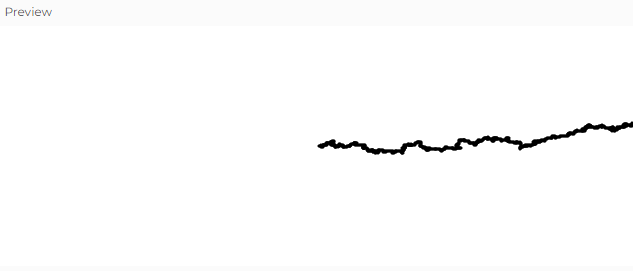

# Camintas aleatorias
### ¿Qué pasaría si el movimiento fuera más probable en una dirección específica, como hacia la derecha?
- Si aumentamos la probabilidad de moverse hacia la derecha, el punto debería desplazarse en promedio hacia la derecha en lugar de oscilar alrededor del centro.

## Modificación del código
Cambiamos la lógica de step() para que la probabilidad de moverse hacia la derecha sea del 50%, mientras que las otras direcciones tengan cada una el 16.67%

¿Cómo cambia la trayectoria de la caminata si hay un sesgo hacia la derecha?

 #### ¿Qué resultados esperas obtener?
- El punto se desplazará en promedio hacia la derecha.
- La trayectoria aún mostrará variabilidad, pero tendrá una tendencia más clara en la derecha.
  #### ¿Qué resultados obtuviste?
- El punto se mueve hacia la derecha en promedio, con algunas oscilaciones verticales o hacia atrás.
- A lo largo del tiempo, el desplazamiento hacia la derecha se vuelve evidente.
  #### ¿Qué aprendiste de este experimento?
- Pequeños cambios en la probabilidad de movimiento pueden generar trayectorias con tendencias claras.
- Este modelo es útil para simular procesos donde hay una preferencia direccional, como el movimiento de partículas en campos eléctricos o la dispersión de organismos en un hábitat.

``` js
// Caminata Aleatoria - Modificación con Probabilidades

let walker;

function setup() {
  createCanvas(640, 240);
  walker = new Walker(width / 2, height / 2); // Se pasa el punto de inicio
  background(255); // Fondo blanco solo una vez
}

function draw() {
  walker.step();
  walker.show();
}

class Walker {
  constructor(x, y) {
    this.x = x;
    this.y = y;
  }

  show() {
    stroke(0);
    strokeWeight(3); // Aumenta el grosor del punto para que sea visible
    point(this.x, this.y);
  }

  step() {
    const r = random(1);
    if (r < 0.5) {
      this.x++; // 50% de probabilidad de moverse a la derecha
    } else if (r < 0.666) {
      this.x--; // 16.67% izquierda
    } else if (r < 0.833) {
      this.y++; // 16.67% abajo
    } else {
      this.y--; // 16.67% arriba
    }
  }
}

```


