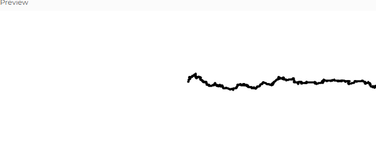

## Distribuciones de probabilidad

### Dsitribución Uniforme
En la distribución uniforme es que todos los valores aleatorios en un rango determinado tienen la misma probabilidad de ocurrir.

### distribución no uniforme
En la distribución no uniforme es la diferencia a la uniforme, es decir que algunos valores tienen mas probabilidad de ocurrir y no todos tienen el mismo peso de ocurrir.

### Conclución
En resumen, la distribución uniforme implica "igualdad" en las probabilidades, mientras que la no uniforme significa que las probabilidades no son iguales para todos los valores posibles.

## Codigo modificado
Voy a usar el ejemplo del anterior ejercicio, que sin querer queriendo hice la caminata aleatoria con una distribución no uniforme favoreciendo el movimiento hacia la derecha. 

Cambiamos la lógica de step() para que la probabilidad de moverse hacia la derecha sea del 50%, mientras que las otras direcciones tengan cada una el 16.67%.

En este claro ejemplo podemos observar como la distribucion no uniforme favorece el movimiento hacia la derecha dandole un peso de mas probalididad que a las otras.


### Codigo

``` js
// Caminata Aleatoria - Modificación con Probabilidades

let walker;

function setup() {
  createCanvas(640, 240);
  walker = new Walker(width / 2, height / 2); // Se pasa el punto de inicio
  background(255); // Fondo blanco solo una vez
}

function draw() {
  walker.step();
  walker.show();
}

class Walker {
  constructor(x, y) {
    this.x = x;
    this.y = y;
  }

  show() {
    stroke(0);
    strokeWeight(3); // Aumenta el grosor del punto para que sea visible
    point(this.x, this.y);
  }

  step() {
    const r = random(1);
    if (r < 0.5) {
      this.x++; // 50% de probabilidad de moverse a la derecha
    } else if (r < 0.666) {
      this.x--; // 16.67% izquierda
    } else if (r < 0.833) {
      this.y++; // 16.67% abajo
    } else {
      this.y--; // 16.67% arriba
    }
  }
}
```


