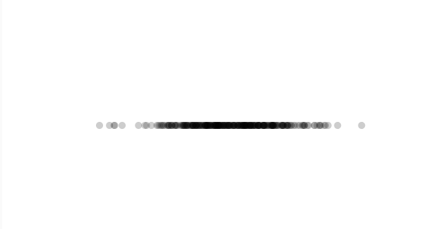

## Distribución Normal
### Explicación de la Distribución Normal en la Visualización
La distribución normal o gaussiana genera valores que se agrupan alrededor de la media, con una mayor frecuencia en el centro y menor frecuencia en los extremos. 
Para visualizar esto, podemos representar los valores generados con círculos, donde la posición horizontal esté determinada por la distribución normal. 
Como resultado, veremos que la mayoría de los círculos se concentran en la parte central del lienzo, con menos cantidad hacia los bordes.


### Codigo
```js
let valores = [];

function setup() {
  createCanvas(640, 360);
  background(255);
}

function draw() {
  let media = width / 2; // Centro de la pantalla
  let desviacion = 60; // Controla la dispersión

  let x = randomGaussian(media, desviacion); // Genera un valor con distribución normal
  let y = height / 2; // Todos los círculos están en la misma línea para ver la distribución

  valores.push(x);

  noStroke();
  fill(0, 50);
  ellipse(x, y, 10, 10); // Dibuja un círculo en la posición generada

  if (valores.length > 500) {
    valores.shift(); // Elimina valores antiguos para no saturar la pantalla
  }
}

```
- ### Generación de números:
  Se usa randomGaussian(media, desviacion), donde la mayoría de los valores estarán cerca de la media.
- ### Visualización:
  Se dibujan círculos en la posición generada para ver la concentración de valores.
- ### Distribución en la pantalla:
  La mayoría de los círculos estarán en el centro con menos cantidad en los extremos, representando la distribución normal.
  

