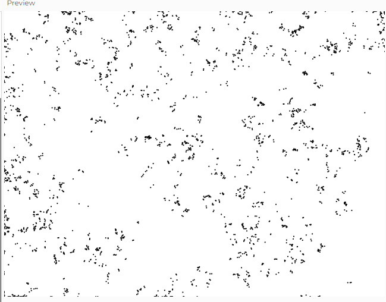

## Distribución personalizada: Lévy flight
### **Explicación: ¿Qué es un Lévy Flight y en qué casos se usa?**

Un **Lévy Flight** es un tipo de caminata aleatoria en la que la mayoría de los pasos son cortos, pero ocasionalmente se generan saltos largos. En contraste con una caminata aleatoria tradicional, donde los movimientos son de tamaño uniforme, en un **Lévy Flight** la distancia de los movimientos sigue una **distribución de potencia** (Power Law), lo que significa que hay eventos poco frecuentes de gran magnitud.

### **Aplicaciones del Lévy Flight**

Los **Lévy Flights** son útiles en fenómenos donde los movimientos presentan una mezcla de **pasos cortos y saltos largos**, como:

-   **Búsqueda de alimentos en animales** (algunas especies de aves, tiburones y monos usan este patrón para optimizar su exploración).
-   **Optimización de algoritmos** (se usa en metaheurísticas como la Optimización por Enjambre de Partículas - PSO).
-   **Análisis de mercados financieros** (modelando movimientos de precios extremos en bolsas de valores).

Un **Lévy Flight** sería particularmente interesante en simulaciones visuales para eventos de DJ, ya que permite generar movimientos dinámicos y no predecibles en las visualizaciones.

### Código
```js
let walker;

function setup() {
  createCanvas(640, 480);
  background(255);
  walker = new Walker(width / 2, height / 2);
}

function draw() {
  walker.step();
  walker.show();
}

class Walker {
  constructor(x, y) {
    this.x = x;
    this.y = y;
  }

  show() {
    stroke(0);
    strokeWeight(2);
    point(this.x, this.y);
  }

  step() {
    let stepSize = this.levy(); // Genera un paso con distribución Lévy

    let angle = random(TWO_PI); // Dirección aleatoria
    this.x += cos(angle) * stepSize;
    this.y += sin(angle) * stepSize;

    // Evita que el punto salga del lienzo
    this.x = constrain(this.x, 0, width);
    this.y = constrain(this.y, 0, height);
  }

  levy() {
    let r = pow(random(1), -1.5); // Genera saltos largos ocasionales con distribución de potencia
    return constrain(r, 1, 100); // Limita la distancia del paso
  }
}

```

