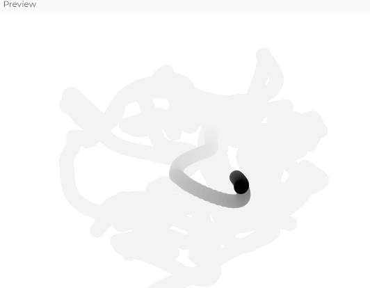

# Ruido Perlin
### **Explicación de la Figura 0.4**
La **figura 0.4** muestra dos gráficos que comparan el comportamiento del **ruido Perlin** y el **ruido aleatorio tradicional** a lo largo del tiempo:

-   **Gráfico de la izquierda (Ruido Perlin):** Se observa que los valores cambian de manera **suave y progresiva**, sin saltos bruscos. Esto significa que los valores están relacionados entre sí y evolucionan gradualmente, lo que da un efecto más natural y fluido.
    
-   **Gráfico de la derecha (Ruido Aleatorio):** Aquí los valores suben y bajan de forma abrupta y sin ningún patrón aparente. Esto sucede porque el ruido aleatorio no tiene relación con los valores anteriores, lo que genera cambios bruscos y caóticos.
    

En resumen, el ruido Perlin es útil para crear movimientos o variaciones suaves en simulaciones, como el desplazamiento de nubes, el movimiento de personajes o cambios en terrenos. En cambio, el ruido aleatorio genera variaciones instantáneas e impredecibles, lo que en algunos casos puede parecer poco natural.

### **Explicación: Cómo se usó el ruido Perlin**

En esta simulación, utilizaremos el **ruido Perlin** para generar un movimiento **suave y orgánico** de un punto en el lienzo. En lugar de moverse de manera abrupta, la posición del punto variará de manera fluida en el tiempo. Esto se logra utilizando la función `noise()` en lugar de `random()`, asegurando que los valores cambien de forma progresiva en lugar de manera repentina.

El resultado será un punto que se mueve **de forma fluida y natural** en la pantalla, sin cambios bruscos. Se verá como si estuviera flotando o deslizándose suavemente.

### Código

```js
let xoff = 0; // Desplazamiento en el ruido Perlin para X
let yoff = 1000; // Desplazamiento separado para Y

function setup() {
  createCanvas(640, 480);
  background(255);
}

function draw() {
  background(255, 10); // Deja un rastro suave

  let x = noise(xoff) * width; // Genera un valor entre 0 y el ancho de la pantalla
  let y = noise(yoff) * height; // Genera un valor entre 0 y la altura de la pantalla

  xoff += 0.01; // Incremento suave en el desplazamiento del ruido Perlin
  yoff += 0.01;

  fill(0);
  noStroke();
  ellipse(x, y, 20, 20); // Dibuja un círculo en la posición generada
}

```

### **Conclusión**

El **ruido Perlin** es una excelente herramienta para generar variaciones suaves en simulaciones, evitando la naturaleza abrupta del ruido aleatorio normal. En esta actividad, lo aplicamos para crear un movimiento fluido en un punto, pero también se puede usar en animaciones de paisajes, efectos de viento o simulaciones de fluidos.


