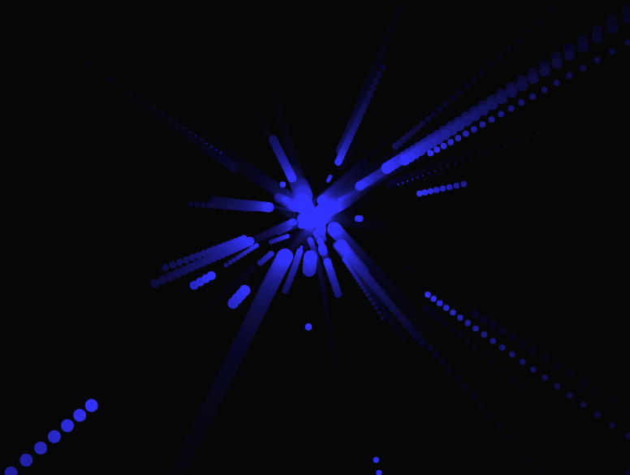
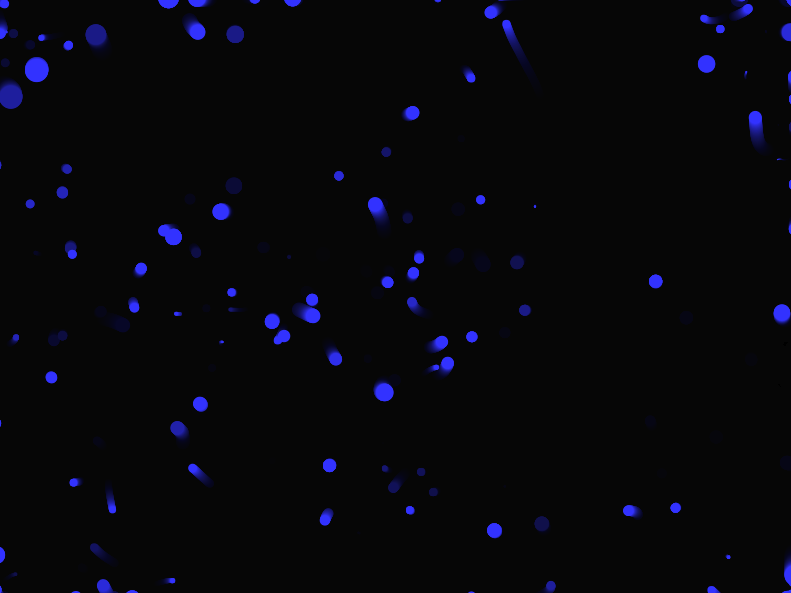

# Materialización
### **Código de la Aplicación en p5.js**

Este código genera partículas que se mueven de forma fluida utilizando **ruido Perlin**, con algunos saltos largos debido a **Lévy Flight**, la **Distribución Normal** para controlar el tamaño de las partículas y su velocidad. Además, **reacciona al sonido del micrófono** y a la posición del mouse para generar variaciones en color y forma.

```js
let particles = [];
let mic;

function setup() {
  createCanvas(800, 600);
  background(0);
  
  // Inicializar micrófono
  mic = new p5.AudioIn();
  mic.start();

  // Crear múltiples partículas con tamaño basado en distribución normal
  for (let i = 0; i < 100; i++) {
    let size = abs(randomGaussian(10, 5)); // Distribución normal para el tamaño
    particles.push(new Particle(random(width), random(height), size));
  }
}

function draw() {
  background(0, 20); // Dejar un rastro visual

  let vol = mic.getLevel(); // Capturar nivel de sonido

  for (let p of particles) {
    p.update(vol);
    p.show();
  }
}

class Particle {
  constructor(x, y, size) {
    this.x = x;
    this.y = y;
    this.size = size;
    this.noiseX = random(1000);
    this.noiseY = random(1000);
    this.color = color(random(255), random(255), random(255));
    this.speed = abs(randomGaussian(2, 1)); // Distribución normal para la velocidad
  }

  update(vol) {
    // Movimiento con ruido Perlin para suavidad
    this.x += (noise(this.noiseX) - 0.5) * this.speed;
    this.y += (noise(this.noiseY) - 0.5) * this.speed;

    // Ocasionalmente, aplicar un salto Lévy
    if (random(1) < 0.02) {
      let stepSize = pow(random(1), -1.5) * 30; // Genera saltos largos
      let angle = random(TWO_PI);
      this.x += cos(angle) * stepSize;
      this.y += sin(angle) * stepSize;
    }

    // Ajustar la saturación del color con el sonido
    let brightness = map(vol, 0, 0.3, 50, 255);
    this.color = color(brightness, brightness, 255);

    // Ajustar dirección con el mouse
    if (mouseIsPressed) {
      this.x += (mouseX - this.x) * 0.05;
      this.y += (mouseY - this.y) * 0.05;
    }

    // Restringir dentro del canvas
    this.x = constrain(this.x, 0, width);
    this.y = constrain(this.y, 0, height);

    // Incrementar los valores de ruido Perlin
    this.noiseX += 0.01;
    this.noiseY += 0.01;
  }

  show() {
    fill(this.color);
    noStroke();
    ellipse(this.x, this.y, this.size, this.size);
  }
}

```

Las partículas no solo se moverán con fluidez y ocasionalmente harán saltos largos, sino que también **tendrán tamaños y velocidades variadas de manera natural**, creando una estética más rica y orgánica.

 - La mayoría de las partículas tendrán un tamaño y velocidad promedio.
- Algunas serán mucho más grandes o pequeñas, gracias a la distribución normal.


### **Conclusión**

Con la incorporación de **Arte Generativo, Ruido Perlin, Lévy Flight y Distribución Normal**, la aplicación ahora tiene un comportamiento más complejo e interesante, con elementos interactivos que evolucionan de forma **natural y dinámica** en respuesta a la entrada del usuario.

### Imagen con la interacción

### Imagen reposo

