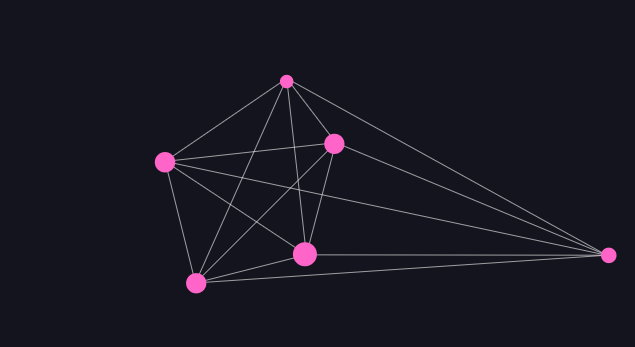
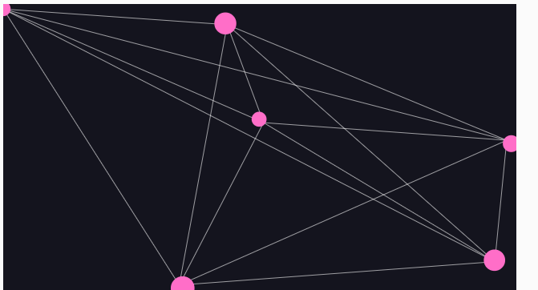

# El problema de los n-cuerpos
Voy a diseñar una simulación interactiva del **problema de los n-cuerpos**, inspirada en las **esculturas cinéticas de Alexander Calder**. La idea será crear un sistema en el que varios cuerpos (planetas o partículas) interactúan entre sí a través de la gravedad, generando un movimiento dinámico y equilibrado como en las esculturas móviles.

### Cómo modelaremos el problema de los n-cuerpos

1.  Cada cuerpo tendrá masa y posición en un espacio 2D.
2.  La fuerza gravitacional se calculará entre cada par de cuerpos, siguiendo la ecuación de la gravitación universal.
3.  Las fuerzas afectarán la aceleración y la velocidad de cada cuerpo, generando órbitas caóticas o patrones en equilibrio.
4.  Inspiración en Calder: En lugar de un espacio vacío, los cuerpos estarán conectados visualmente por líneas, simulando un móvil cinético.


### Cómo funciona el sistema:

1.  **Cuerpos con masa:** Se generan varios cuerpos con diferentes masas y posiciones aleatorias.
2.  **Fuerza gravitacional entre cada par:** Cada cuerpo atrae a los demás usando la ley de gravitación universal.
3.  **Actualización del movimiento:** La aceleración generada por la gravedad afecta la velocidad y la posición de cada cuerpo.
4.  **Conexión visual:** Se dibujan líneas entre los cuerpos para dar la sensación de un móvil dinámico y en equilibrio.


**Efecto visual:**


-   Las partículas se atraen entre sí, creando órbitas caóticas o sistemas equilibrados.
-   El patrón cambia constantemente, evocando la estética de las esculturas cinéticas.

### Código
```js
// Simulación del problema de los n-cuerpos inspirado en esculturas cinéticas de Alexander Calder
let bodies = [];
let G = 1; // Constante gravitacional simulada

function setup() {
  createCanvas(640, 360);
  for (let i = 0; i < 6; i++) {
    bodies.push(new Body(random(width), random(height), random(4, 8)));
  }
}

function draw() {
  background(20, 20, 30);

  // Dibujar conexiones como una escultura cinética
  stroke(255, 150);
  strokeWeight(1);
  for (let i = 0; i < bodies.length; i++) {
    for (let j = i + 1; j < bodies.length; j++) {
      line(bodies[i].position.x, bodies[i].position.y, bodies[j].position.x, bodies[j].position.y);
    }
  }

  // Calcular fuerzas gravitacionales
  for (let i = 0; i < bodies.length; i++) {
    for (let j = 0; j < bodies.length; j++) {
      if (i !== j) {
        let force = bodies[j].attract(bodies[i]);
        bodies[i].applyForce(force);
      }
    }
  }

  // Actualizar y mostrar los cuerpos
  for (let body of bodies) {
    body.update();
    body.checkEdges(); // Evitar que se salga de la pantalla
    body.show();
  }
}

class Body {
  constructor(x, y, m) {
    this.mass = m;
    this.position = createVector(x, y);
    this.velocity = createVector(random(-1, 1), random(-1, 1));
    this.acceleration = createVector(0, 0);
  }

  applyForce(force) {
    let f = force.copy().div(this.mass);
    this.acceleration.add(f);
  }

  attract(other) {
    let force = p5.Vector.sub(this.position, other.position);
    let distance = constrain(force.mag(), 5, 25);
    force.normalize();
    let strength = (G * this.mass * other.mass) / (distance * distance);
    force.mult(strength);
    return force;
  }

  update() {
    this.velocity.add(this.acceleration);
    this.position.add(this.velocity);
    this.acceleration.mult(0);
  }

  checkEdges() {
    // Mantener los cuerpos dentro de la pantalla
    if (this.position.x < 0 || this.position.x > width) {
      this.velocity.x *= -1; // Rebote horizontal
    }
    if (this.position.y < 0 || this.position.y > height) {
      this.velocity.y *= -1; // Rebote vertical
    }
    
    // Asegurar que los cuerpos permanezcan en la pantalla
    this.position.x = constrain(this.position.x, 0, width);
    this.position.y = constrain(this.position.y, 0, height);
  }

  show() {
    fill(255, 100, 200);
    noStroke();
    ellipse(this.position.x, this.position.y, this.mass * 3);
  }
}
```
[Link del proyecto](https://editor.p5js.org/tiago123fk/sketches/7FIj0VVFz)
### Imagen



## Prueba diferente
### **Explicación de la Simulación de Coreografía Espacial**

Este proyecto es una versión más artística y dinámica del **problema de los n-cuerpos**, donde los cuerpos no solo interactúan por gravedad, sino que también siguen **patrones oscilatorios** inspirados en coreografías espaciales y sincronización con música.


### ¿Cómo Funciona la Simulación?


**Cuerpos con Gravedad y Atracción:**

-   Cada cuerpo atrae a los demás según la ecuación de la gravedad.
-   La fuerza de atracción varía según la distancia y la masa de los cuerpos.


**Oscilaciones Inspiradas en el Movimiento de Danza:**


-   Los cuerpos no solo siguen la gravedad, sino que también tienen **movimientos oscilatorios** controlados por `sin()` y `cos()`.
-   Cada cuerpo tiene un **patrón de oscilación único**, lo que hace que se muevan de manera fluida y natural.


**Interacción con la Música:**


-   **Los bajos (bass)** → Aumentan la atracción gravitacional.
-   **Los medios (mid)** → Modifican la intensidad de las oscilaciones.
-   **Los agudos (treble)** → Cambian los colores de las partículas.


**Efecto Visual Inspirado en Calder:**


-   Los cuerpos están **conectados con líneas**, simulando la estructura de un móvil cinético.
-   Las partículas oscilan suavemente, creando un patrón visual atractivo y rítmico.

### Código
```js
// Simulación del problema de los n-cuerpos inspirado en esculturas cinéticas de Alexander Calder con reacción a la música
let bodies = [];
let G = 1; // Constante gravitacional simulada
let sound;
let fft;

function preload() {
  sound = loadSound('Nokia.mp3'); // Carga una canción (reemplázala con la tuya)
}

function setup() {
  createCanvas(640, 360);
  sound.setVolume(0.7);
  fft = new p5.FFT(); // Análisis de audio
  sound.play();
  
  for (let i = 0; i < 6; i++) {
    bodies.push(new Body(random(width), random(height), random(4, 8)));
  }
}

function draw() {
  background(20, 20, 30);

  let spectrum = fft.analyze();
  let bass = fft.getEnergy('bass');
  let mid = fft.getEnergy('mid');
  let treble = fft.getEnergy('treble');
  
  let soundInfluence = map(bass, 0, 255, 0.5, 2); // Ajusta la influencia del sonido

  // Dibujar conexiones como una escultura cinética
  stroke(255, 150);
  strokeWeight(1);
  for (let i = 0; i < bodies.length; i++) {
    for (let j = i + 1; j < bodies.length; j++) {
      line(bodies[i].position.x, bodies[i].position.y, bodies[j].position.x, bodies[j].position.y);
    }
  }

  // Calcular fuerzas gravitacionales
  for (let i = 0; i < bodies.length; i++) {
    for (let j = 0; j < bodies.length; j++) {
      if (i !== j) {
        let force = bodies[j].attract(bodies[i]);
        bodies[i].applyForce(force);
      }
    }
  }

  // Actualizar y mostrar los cuerpos con efectos de sonido
  for (let body of bodies) {
    body.oscillate(mid, soundInfluence);
    body.update();
    body.checkEdges();
    body.show(treble);
  }
}

class Body {
  constructor(x, y, m) {
    this.mass = m;
    this.position = createVector(x, y);
    this.velocity = createVector(random(-1, 1), random(-1, 1));
    this.acceleration = createVector(0, 0);
    this.angle = random(TWO_PI);
  }

  applyForce(force) {
    let f = force.copy().div(this.mass);
    this.acceleration.add(f);
  }

  attract(other) {
    let force = p5.Vector.sub(this.position, other.position);
    let distance = constrain(force.mag(), 5, 25);
    force.normalize();
    let strength = (G * this.mass * other.mass) / (distance * distance);
    force.mult(strength);
    return force;
  }

  oscillate(mid, influence) {
    let oscillation = sin(this.angle) * influence * mid * 0.01;
    this.position.x += oscillation * 2; // Oscilación suave horizontal
    this.position.y += oscillation * 2; // Oscilación suave vertical
    this.angle += 0.02; // Movimiento continuo
  }

  update() {
    this.velocity.add(this.acceleration);
    this.position.add(this.velocity);
    this.acceleration.mult(0);
  }

  checkEdges() {
    if (this.position.x < 0 || this.position.x > width) {
      this.velocity.x *= -1; // Rebote horizontal
    }
    if (this.position.y < 0 || this.position.y > height) {
      this.velocity.y *= -1; // Rebote vertical
    }
    this.position.x = constrain(this.position.x, 0, width);
    this.position.y = constrain(this.position.y, 0, height);
  }

  show(treble) {
    let colorG = map(treble, 0, 255, 100, 255);
    fill(255, colorG, 200);
    noStroke();
    ellipse(this.position.x, this.position.y, this.mass * 4);
  }
}

```
[Link del proyecto](https://editor.p5js.org/tiago123fk/sketches/xg7VAEXxg)
### Imagen 



