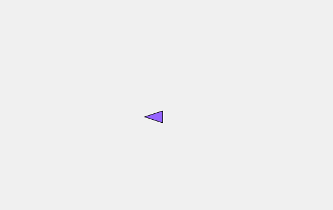
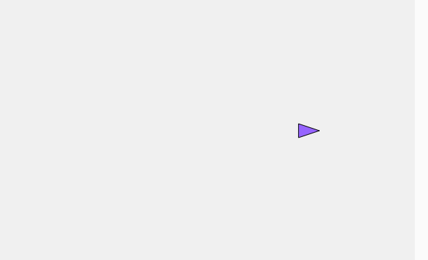

# Practica un poco
### código
```js
let vehicle;

function setup() {
  createCanvas(600, 400);
  vehicle = new Vehicle(width / 2, height / 2);
}

function draw() {
  background(240);
  vehicle.update();
  vehicle.display();
}

function keyPressed() {
  if (keyCode === LEFT_ARROW) {
    vehicle.applyForce(createVector(-0.1, 0));
  } else if (keyCode === RIGHT_ARROW) {
    vehicle.applyForce(createVector(0.1, 0));
  }
}

class Vehicle {
  constructor(x, y) {
    this.position = createVector(x, y);
    this.velocity = createVector(0, 0);
    this.acceleration = createVector(0, 0);
  }

  applyForce(force) {
    this.acceleration.add(force);
  }

  update() {
    this.velocity.add(this.acceleration);
    this.velocity.limit(5);
    this.position.add(this.velocity);
    this.acceleration.mult(0);
    this.velocity.mult(0.98); // fricción suave

    // Pantalla infinita horizontal
    if (this.position.x > width) this.position.x = 0;
    if (this.position.x < 0) this.position.x = width;
  }

  display() {
    // Solo rota si hay movimiento significativo
    let angle = 0;
    if (this.velocity.mag() > 0.1) {
      angle = this.velocity.heading();
    }

    push();
    translate(this.position.x, this.position.y);
    rotate(angle);

    fill(150, 100, 255);
    stroke(0);
    strokeWeight(1);
    // Triángulo apuntando hacia la derecha por defecto
    triangle(20, 0, -10, -10, -10, 10);
    pop();
  }
}

```
[Simulación](https://editor.p5js.org/tiago123fk/sketches/WGTcnB2_M)
### Imagen izquierda




### imagen derecha 

