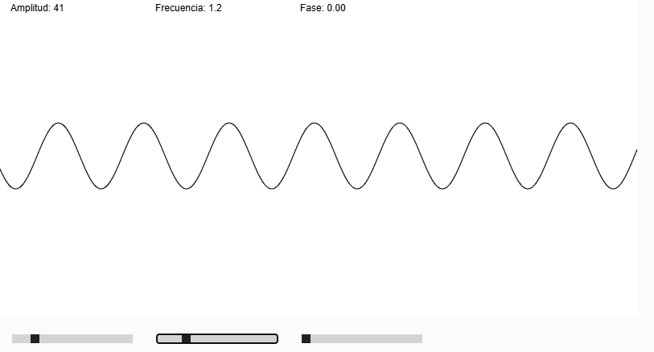

# Funciones sinusoides
### ¿Qué es sinusoides?
En [matemática](https://es.wikipedia.org/wiki/Matem%C3%A1tica "Matemática") se denomina **sinusoide** o **senoide** a la curva que representa gráficamente la función [seno](https://es.wikipedia.org/wiki/Seno_(matem%C3%A1tica) "Seno (matemática)") y también a dicha función en sí.[[1]](https://es.wikipedia.org/wiki/Sinusoide#cite_note-1)​ Es una curva que describe una oscilación repetitiva y suave. PDTA( Copie la definición de wikipedia)


Vamos a crear una simulación interactiva de una **función sinusoide** (`y = A * sin(ωt + φ)`) donde puedas modificar los siguientes parámetros:

-   **Amplitud (A):** Qué tan alta es la onda.
    
-   **Frecuencia (f):** Cuántas ondas por segundo.
    
-   **Velocidad angular (ω)**: Relacionada con la frecuencia: ω = 2πf
    
-   **Periodo (T):** Tiempo de una onda: T = 1/f
    
-   **Fase (φ):** Corrimiento horizontal de la onda.


### ¿Qué haremos?

Usaremos _sliders_ (`createSlider()` de p5.js) para controlar **amplitud**, **frecuencia** y **fase**, y ver cómo se altera la onda en tiempo real.

```js
function setup() {
  createCanvas(400, 400);
}

function draw() {
  background(220);
}let amplitudeSlider, frequencySlider, phaseSlider;
let t = 0;

function setup() {
  createCanvas(800, 400);

  // Sliders
  amplitudeSlider = createSlider(10, 200, 100);
  amplitudeSlider.position(20, height + 20);
  amplitudeSlider.style('width', '150px');

  frequencySlider = createSlider(0.1, 5, 1, 0.1);
  frequencySlider.position(200, height + 20);
  frequencySlider.style('width', '150px');

  phaseSlider = createSlider(0, TWO_PI, 0, 0.1);
  phaseSlider.position(380, height + 20);
  phaseSlider.style('width', '150px');
}

function draw() {
  background(255);
  stroke(0);
  noFill();
  translate(0, height / 2);

  let A = amplitudeSlider.value();
  let f = frequencySlider.value();
  let ω = TWO_PI * f;
  let φ = phaseSlider.value();

  beginShape();
  for (let x = 0; x < width; x++) {
    let y = A * sin(ω * (x / width * TWO_PI) + φ);
    vertex(x, y);
  }
  endShape();

  // Etiquetas
  noStroke();
  fill(0);
  text('Amplitud: ' + A, 20, -height / 2 + 20);
  text('Frecuencia: ' + f.toFixed(1), 200, -height / 2 + 20);
  text('Fase: ' + φ.toFixed(2), 380, -height / 2 + 20);
}

```
[Link Simulación](https://editor.p5js.org/tiago123fk/sketches/4faX-ADZ_)

### Imagen

