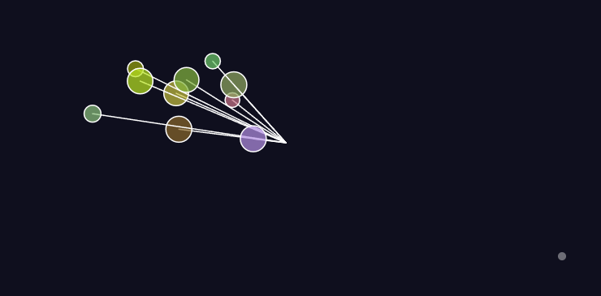

# Repasa conceptos de las unidades anteriores
En esta actividad partimos de una simulación basada en osciladores del libro _The Nature of Code_, y la modificamos para integrar conceptos clave de las unidades anteriores. Desde la **Unidad 1**, incorporamos la **aleatoriedad** al asignar valores aleatorios de amplitud, dirección y color a cada oscilador. Desde la **Unidad 3**, aplicamos el concepto de **fuerzas**, permitiendo que los osciladores reaccionen a una fuerza de tipo "gravedad" simulada.


Además, agregamos una **interacción por micrófono**, permitiendo que los osciladores se activen o se aceleren **solo cuando se detecta sonido**, lo cual refuerza la idea de fuerzas dinámicas y controladas. También mejoramos el aspecto visual con una entrada animada, efectos suaves y un fondo visualmente más atractivo, lo que hace que la simulación sea más clara, interactiva y expresiva.


Esta versión final no solo repasa los conceptos clave, sino que también mejora la experiencia del usuario y demuestra cómo se pueden combinar ideas de múltiples unidades en una sola pieza interactiva.

### Código

```js
let oscillators = [];
let mic;
let gravityBase;
let threshold = 0.05; // umbral de volumen para activar la fuerza

function setup() {
  createCanvas(800, 400);
  mic = new p5.AudioIn();
  mic.start();

  for (let i = 0; i < 10; i++) {
    oscillators.push(new Oscillator());
  }

  gravityBase = createVector(0.005, 0.005); // fuerza básica suave
}

function draw() {
  background(15, 15, 30);

  let volume = mic.getLevel(); // volumen del micrófono

  for (let osc of oscillators) {
    if (volume > threshold) {
      let gravity = p5.Vector.mult(gravityBase, map(volume, threshold, 1, 1, 8));
      osc.applyForce(gravity);
    }
    osc.update();
    osc.show();
  }

  // Indicador visual de volumen
  fill(255, 100);
  noStroke();
  let volCircle = map(volume, 0, 1, 10, 200);
  ellipse(width - 60, height - 60, volCircle);
}

class Oscillator {
  constructor() {
    this.angle = createVector();
    this.angleVelocity = createVector(random(-0.02, 0.02), random(-0.02, 0.02));
    this.angleAcceleration = createVector(0, 0);

    // Amplitud objetivo y amplitud actual (para animación de entrada suave)
    this.amplitude = createVector(random(40, width / 3), random(40, height / 3));
    this.actualAmplitude = createVector(0, 0); // empieza desde 0

    this.color = color(random(100, 255), random(100, 255), random(255), 180);
  }

  applyForce(force) {
    this.angleAcceleration.add(force);
  }

  update() {
    this.angleVelocity.add(this.angleAcceleration);
    this.angle.add(this.angleVelocity);
    this.angleAcceleration.mult(0);

    // Fricción suave para evitar aceleración infinita
    this.angleVelocity.mult(0.98);

    // Interpolación suave para que la amplitud crezca desde 0 al inicio
    this.actualAmplitude.lerp(this.amplitude, 0.05);
  }

  show() {
    let x = sin(this.angle.x) * this.actualAmplitude.x;
    let y = sin(this.angle.y) * this.actualAmplitude.y;

    push();
    translate(width / 2, height / 2);
    stroke(255);
    strokeWeight(1.5);
    fill(this.color);
    line(0, 0, x, y);
    ellipse(x, y, 24 + sin(this.angle.x * 2) * 8); // tamaño oscilante
    pop();
  }
}

``` 
[Link simulación](https://editor.p5js.org/tiago123fk/sketches/uw_aoh8t0)

### Imagen

