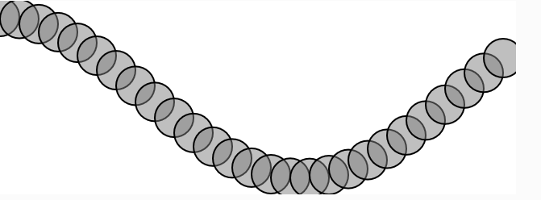

# Ondas
### ¿Qué haremos?

El código actual dibuja una onda estática, porque todo está dentro de `setup()`.  
Para que se mueva como una ola, necesitamos:

-   Dibujar cada frame dentro de `draw()`.
    
-   Usar un offset de ángulo que avanza con el tiempo.
    
-   Redibujar toda la onda en cada frame.


### Código

```js
// Basado en The Nature of Code
let startAngle = 0;
let angleVelocity = 0.2;
let amplitude = 100;
let xSpacing = 24;

function setup() {
  createCanvas(640, 240);
}

function draw() {
  background(255);

  let angle = startAngle;

  stroke(0);
  strokeWeight(2);
  fill(127, 127);

  for (let x = 0; x <= width; x += xSpacing) {
    let y = amplitude * sin(angle);
    circle(x, y + height / 2, 48);
    angle += angleVelocity;
  }

  // Esto hace que se desplace en el tiempo
  startAngle += 0.05;
}

```
[Link simulación](https://editor.p5js.org/tiago123fk/sketches/2up-MyBCt)

### imagen

