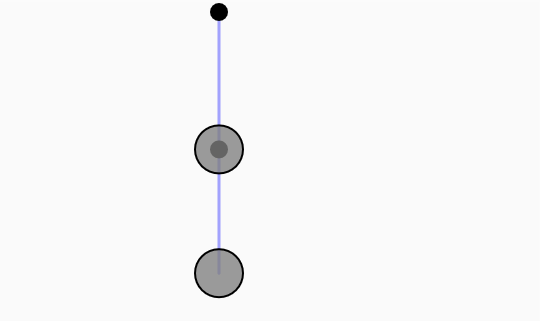

# Resortes
### ¿Qué se pide?

Crear dos resortes en serie, es decir: SPRING1 — BOB1 — SPRING2 — BOB2


**Visualmente sería:**

-   El primer resorte está anclado al techo.
    
-   El segundo resorte cuelga desde el primer bob (objeto).
    
-   Ambos bobs se mueven bajo fuerzas físicas.


### Modificaciones clave que haremos:

1.  Crear 2 objetos `Spring` y 2 objetos `Bob`.
    
2.  El primer resorte se conecta del techo al `bob1`.
    
3.  El segundo resorte se conecta desde `bob1` al `bob2`.
    
4.  Aplicamos gravedad a los dos bobs.
    
5.  Calculamos fuerzas de los dos resortes.
    
6.  Agregamos interacción para arrastrar el último bob (`bob2`).

### Código
```js
// --- CLASE SPRING ---
class Spring {
  constructor(x, y, len) {
    this.anchor = createVector(x, y);
    this.len = len;
    this.k = 0.05; // valor por defecto, se puede cambiar luego
  }

  connect(bob) {
    let force = p5.Vector.sub(bob.position, this.anchor);
    let d = force.mag();
    let stretch = d - this.len;
    force.normalize();
    force.mult(-1 * this.k * stretch);
    bob.applyForce(force);
  }

  constrainLength(bob, minlen, maxlen) {
    let dir = p5.Vector.sub(bob.position, this.anchor);
    let d = dir.mag();
    if (d < minlen) {
      dir.normalize();
      dir.mult(minlen);
      bob.position = p5.Vector.add(this.anchor, dir);
      bob.velocity.mult(0);
    } else if (d > maxlen) {
      dir.normalize();
      dir.mult(maxlen);
      bob.position = p5.Vector.add(this.anchor, dir);
      bob.velocity.mult(0);
    }
  }

  show() {
    fill(0);
    stroke(0);
    strokeWeight(2);
    ellipse(this.anchor.x, this.anchor.y, 16);
  }

  showLine(bob) {
    stroke(100, 100, 255, 150);
    strokeWeight(3);
    line(bob.position.x, bob.position.y, this.anchor.x, this.anchor.y);
  }
}

// --- CLASE BOB ---
class Bob {
  constructor(x, y) {
    this.position = createVector(x, y);
    this.velocity = createVector();
    this.acceleration = createVector();
    this.mass = 24;
    this.dragOffset = createVector();
    this.dragging = false;
  }

  applyForce(force) {
    let f = p5.Vector.div(force, this.mass);
    this.acceleration.add(f);
  }

  update() {
    if (!this.dragging) {
      this.velocity.add(this.acceleration);
      this.position.add(this.velocity);
      this.acceleration.mult(0);

      // Fricción diferenciada
      if (this === bob1) {
        this.velocity.mult(1); // bob1 casi sin fricción
      } else {
        this.velocity.mult(0.98); // bob2 normal
      }
    }
  }

  show() {
    fill(this.dragging ? color(50) : color(127, 200));
    stroke(0);
    strokeWeight(2);
    ellipse(this.position.x, this.position.y, this.mass * 2);
  }

  handleClick(mx, my) {
    let d = dist(mx, my, this.position.x, this.position.y);
    if (d < this.mass) {
      this.dragging = true;
      this.dragOffset = p5.Vector.sub(this.position, createVector(mx, my));
    }
  }

  handleDrag(mx, my) {
    if (this.dragging) {
      this.position = createVector(mx, my).add(this.dragOffset);
    }
  }

  stopDragging() {
    this.dragging = false;
  }
}

// --- PROGRAMA PRINCIPAL ---
let spring1, spring2;
let bob1, bob2;

function setup() {
  createCanvas(640, 400);
  spring1 = new Spring(width / 2, 10, 100);
  bob1 = new Bob(width / 2, 150);
  spring2 = new Spring(bob1.position.x, bob1.position.y, 100);
  bob2 = new Bob(width / 2, 250);

  // Ajuste personalizado de la rigidez del resorte
  spring1.k = 0.08; // un poco más rígido para mover bob1
  spring2.k = 0.05; // más elástico para bob2
}

function draw() {
  background(250);

  let gravity = createVector(0, 2);
  bob1.applyForce(gravity);
  bob2.applyForce(gravity);

  bob1.update();
  bob2.update();

  bob2.handleDrag(mouseX, mouseY);

  spring1.connect(bob1);
  spring1.constrainLength(bob1, 30, 200);

  spring2.anchor.set(bob1.position.x, bob1.position.y);
  spring2.connect(bob2);
  spring2.constrainLength(bob2, 30, 200);

  spring1.showLine(bob1);
  spring2.showLine(bob2);

  spring1.show();
  spring2.show();

  bob1.show();
  bob2.show();
}

function mousePressed() {
  bob2.handleClick(mouseX, mouseY);
}

function mouseReleased() {
  bob2.stopDragging();
}

```
[Link simulación](https://editor.p5js.org/tiago123fk/sketches/P0nF2r1sR)

### imagen

