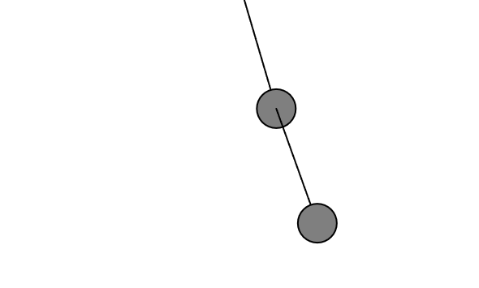

# Péndulos
### ¿Qué haremos?

-   Crear un `pendulum1` anclado al techo.
    
-   Crear un `pendulum2` colgando del bob de `pendulum1`.
    
-   Actualizar ambos en orden.
    
-   Hacer que solo el segundo péndulo se pueda arrastrar con el mouse (para más caos).


### Código
```js
// CLASE Pendulum

class Pendulum {
  constructor(x, y, r) {
    this.pivot = createVector(x, y);
    this.bob = createVector();
    this.r = r;
    this.angle = PI / 4;
    this.angleVelocity = 0.0;
    this.angleAcceleration = 0.0;
    this.damping = 0.995;
    this.ballr = 24.0;
    this.dragging = false;
  }

  update() {
    if (!this.dragging) {
      let gravity = 0.4;
      this.angleAcceleration = ((-1 * gravity) / this.r) * sin(this.angle);
      this.angleVelocity += this.angleAcceleration;
      this.angle += this.angleVelocity;
      this.angleVelocity *= this.damping;
    }
  }

  show() {
    this.bob.set(this.r * sin(this.angle), this.r * cos(this.angle), 0);
    this.bob.add(this.pivot);

    stroke(0);
    strokeWeight(2);
    line(this.pivot.x, this.pivot.y, this.bob.x, this.bob.y);
    fill(127);
    circle(this.bob.x, this.bob.y, this.ballr * 2);
  }

  clicked(mx, my) {
    let d = dist(mx, my, this.bob.x, this.bob.y);
    if (d < this.ballr) {
      this.dragging = true;
    }
  }

  stopDragging() {
    this.angleVelocity = 0;
    this.dragging = false;
  }

  drag() {
    if (this.dragging) {
      let diff = p5.Vector.sub(this.pivot, createVector(mouseX, mouseY));
      this.angle = atan2(-1 * diff.y, diff.x) - radians(90);
    }
  }

  setPivot(x, y) {
    this.pivot.set(x, y);
  }
}


// SKETCH PRINCIPAL

let pendulum1, pendulum2;

function setup() {
  createCanvas(640, 400);
  pendulum1 = new Pendulum(width / 2, 0, 150);
  pendulum2 = new Pendulum(0, 0, 150); // el pivote se actualiza dinámicamente
}

function draw() {
  background(255);

  pendulum1.update();
  pendulum1.show();

  pendulum2.setPivot(pendulum1.bob.x, pendulum1.bob.y);
  pendulum2.update();
  pendulum2.show();

  pendulum2.drag(); // Solo el segundo se puede arrastrar
}

function mousePressed() {
  pendulum2.clicked(mouseX, mouseY);
}

function mouseReleased() {
  pendulum2.stopDragging();
}

```
[Link Simulación](https://editor.p5js.org/tiago123fk/sketches/Dxgx-Vq2J)

### Imagen

