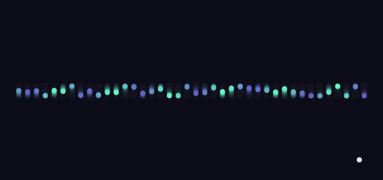
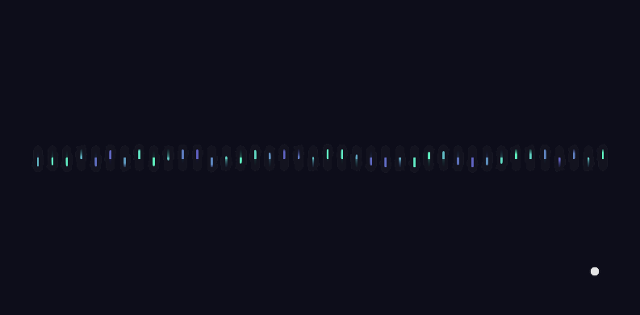
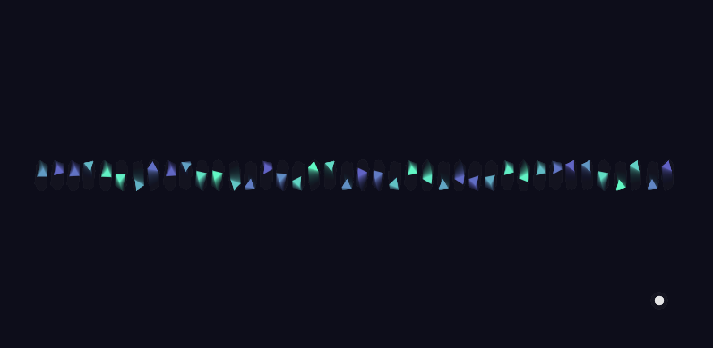

# Obra de arte generativa algorítmica interactiva en tiempo real
### Idea inicial

Inspirado en los conceptos de movimiento oscilatorio, ondas y fuerzas vistos en unidades anteriores, quise crear una obra generativa interactiva que no solo se viera atractiva visualmente, sino que **respondiera al sonido del entorno en tiempo real**. La intención era capturar la energía de la voz o el ambiente y traducirla en un lenguaje visual fluido, casi como una forma de danza digital.


#### Concepto seleccionado

-   Movimiento oscilatorio / ondas sinusoides
    
-   Entrada en tiempo real: micrófono
    
-   Generatividad: color, forma, transformación en tiempo real

#### **Boceto y exploración**

Empecé con una visualización simple de círculos que oscilaban verticalmente. Luego pensé: ¿y si esas ondas cambiaran con la voz?  


Exploré cómo el micrófono podía influir en la **amplitud, tamaño y color** de cada forma. Probé diferentes elementos visuales: círculos, líneas, triángulos. Después agregué estela visual para dar una sensación más orgánica y onírica (Dándole un toque psicodélico).

#### Interacción

-   **Micrófono:** controla el tamaño, movimiento y color de los elementos.
    
-   **Teclado:**
    
    -   `1`: modo círculo.
        
    -   `2`: modo línea.
        
    -   `3`: modo triángulo.
        
-   **Estela visual:** crea un efecto de memoria del movimiento.

#### Proceso y experimentación

-   Ajusté la sensibilidad del micrófono usando `getLevel()`.
    
-   Jugué con `sin()` y `frameCount` para dar oscilación constante.
    
-   Probé diferentes mapeos de volumen a tamaño, color y posición.
    
-   Implementé `keyPressed()` para cambiar entre modos visuales.
    
-   Refiné el fondo con transparencia para crear estela suave.

#### **Resultado final**

Una obra visual que **respira con el sonido**, que cambia dinámicamente de forma y color, y que responde a la interacción del usuario en tiempo real. Permite explorar estados de calma o intensidad según el volumen, y cambia de estilo con un toque de teclado.

### Código 
```js
let mic;
let numCircles = 40;
let circles = [];
let mode = 1;

function setup() {
  createCanvas(800, 400);
  mic = new p5.AudioIn();
  mic.start();

  for (let i = 0; i < numCircles; i++) {
    let x = map(i, 0, numCircles - 1, 50, width - 50);
    circles.push(new OscillatingCircle(x, i));
  }
}

function draw() {
  background(10, 10, 30, 20); // estela visual suave

  let volume = mic.getLevel();

  for (let c of circles) {
    c.update(volume);
    c.show();
  }

  // Indicador de volumen
  noStroke();
  fill(255, 100);
  let volSize = map(volume, 0, 1, 10, 200);
  ellipse(width - 60, height - 60, volSize);
}

class OscillatingCircle {
  constructor(x, i) {
    this.x = x;
    this.index = i;
    this.baseY = height / 2;
    this.offset = random(TWO_PI);
    this.color = color(255);
    this.size = 20;
  }

  update(vol) {
    // Oscilación vertical tipo onda
    this.y = this.baseY + sin(frameCount * 0.05 + this.offset) * map(vol, 0, 1, 10, 150);
    this.size = map(vol, 0, 1, 10, 60);

    // Cambio de color según volumen
    let r = map(vol, 0, 1, 100, 255);
    let g = map(sin(this.index + frameCount * 0.02), -1, 1, 100, 255);
    let b = map(vol, 0, 1, 200, 255);
    this.color = color(r, g, b, 200);
  }

  show() {
    noStroke();
    fill(this.color);

    if (mode === 1) {
      ellipse(this.x, this.y, this.size);
    } else if (mode === 2) {
      stroke(this.color);
      strokeWeight(2);
      line(this.x, height / 2, this.x, this.y);
    } else if (mode === 3) {
      let angle = frameCount * 0.02 + this.offset;
      push();
      translate(this.x, this.y);
      rotate(angle);
      triangle(0, -this.size / 2, -this.size / 2, this.size / 2, this.size / 2, this.size / 2);
      pop();
    }
  }
}

function keyPressed() {
  if (key === '1') mode = 1;
  if (key === '2') mode = 2;
  if (key === '3') mode = 3;
}

```
[Link Simulación](https://editor.p5js.org/tiago123fk/sketches/jyZClL9FH)
### imágenes

#### Primera interacción

#### Segunda interacción

#### tercera interacción

