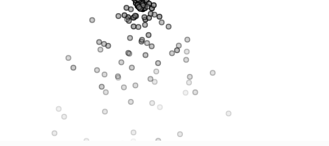
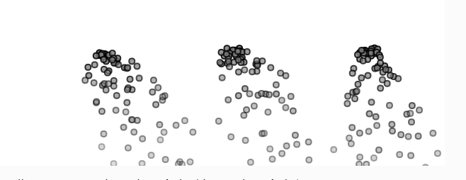
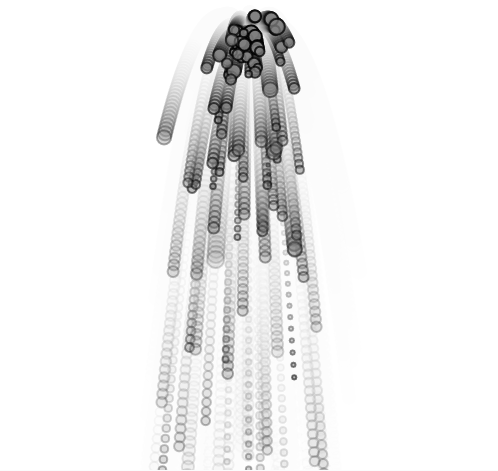
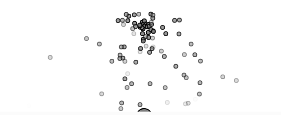

# Revisa y repasa algunos conceptos
### Ejemplo 4.2: [an Array of Particles](https://natureofcode.com/particles/#example-42-an-array-of-particles).
Vamos a usar el concepto de ruido Perlin de la unidad donde vimos aleatoriedad y movimiento orgánico. Es perfecto para este ejemplo porque nos permite que las partículas no se muevan de forma tan lineal o artificial, sino más natural y fluida.


Vamos a modificar la dirección inicial del _velocity_ usando ruido Perlin en vez de `random(-1, 1)` directamente. Además, vamos a darle una pequeña variación en la aceleración también con ruido. Esto le da a cada partícula un movimiento más orgánico desde el inicio.
### Código

```js
let particles = [];

function setup() {
  createCanvas(640, 240);
}

function draw() {
  background(255);
  particles.push(new Particle(width / 2, 20));

  for (let i = particles.length - 1; i >= 0; i--) {
    let particle = particles[i];
    particle.run();
    if (particle.isDead()) {
      particles.splice(i, 1);
    }
  }
}

// ------------------ Clase Particle ------------------

class Particle {
  constructor(x, y) {
    this.position = createVector(x, y);
    this.acceleration = createVector(0, 0);
    this.noiseOffset = random(1000); // Semilla para el ruido
    this.velocity = createVector(
      map(noise(this.noiseOffset), 0, 1, -1, 1),
      map(noise(this.noiseOffset + 100), 0, 1, -2, 0)
    );
    this.lifespan = 255.0;
  }

  run() {
    let gravity = createVector(0, 0.05);
    this.applyForce(gravity);
    this.update();
    this.show();
  }

  applyForce(force) {
    this.acceleration.add(force);
  }

  update() {
    let n = noise(this.noiseOffset + frameCount * 0.01);
    let wiggle = map(n, 0, 1, -0.05, 0.05);
    this.acceleration.x += wiggle;

    this.velocity.add(this.acceleration);
    this.position.add(this.velocity);
    this.lifespan -= 2;
    this.acceleration.mult(0);
  }

  show() {
    stroke(0, this.lifespan);
    strokeWeight(2);
    fill(127, this.lifespan);
    circle(this.position.x, this.position.y, 8);
  }

  isDead() {
    return this.lifespan < 0.0;
  }
}

```
[An array  of particles](https://editor.p5js.org/tiago123fk/sketches/O0KY4UPNN)
#### ¿Cómo se está gestionando la creación y la desaparición de las partículas y cómo se gestiona la memoria?
En esta simulación, las partículas se crean en cada frame y se almacenan en un arreglo. Cada partícula tiene una vida útil que se va reduciendo progresivamente (`lifespan`). Cuando su vida llega a cero, se elimina del arreglo usando `splice()`, lo que permite liberar memoria y mantener el rendimiento.
#### ¿Qué concepto aplicaste, cómo lo aplicaste y por qué?
Apliqué el concepto de  ruido Perlin para reemplazar la aleatoriedad pura del movimiento inicial. Esto permite que las partículas tengan un desplazamiento más fluido y natural. Lo hice usando la función `noise()` para generar valores suaves y continuos que afectan tanto la velocidad inicial como la aceleración en el eje X, dándole una sensación más orgánica. Elegí este concepto porque me interesa que las simulaciones se sientan vivas y más cercanas al movimiento natural.
#### imagen


### Ejemplo 4.4: [a System of Systems](https://natureofcode.com/particles/#example-44-a-system-of-systems).

Aceleración según la posición del mouse este concepto viene de las unidades anteriores donde exploramos inputs dinámicos del usuario, y lo vamos a usar para que las partículas reaccionen ligeramente a la posición del mouse (cuando esté en pantalla). Esto introduce interacción en el sistema, haciendo que no sea solo automático, sino también influenciable.
#### código
```js
let emitters = [];

function setup() {
  createCanvas(640, 240);
  createP("Haz clic para agregar emisores de partículas (sistemas de partículas).");
}

function draw() {
  background(255);
  for (let emitter of emitters) {
    emitter.run();
    emitter.addParticle();
  }
}

function mousePressed() {
  emitters.push(new Emitter(mouseX, mouseY));
}

// ------------------ Clase Emitter ------------------

class Emitter {
  constructor(x, y) {
    this.origin = createVector(x, y);
    this.particles = [];
  }

  addParticle() {
    this.particles.push(new Particle(this.origin.x, this.origin.y));
  }

  run() {
    for (let i = this.particles.length - 1; i >= 0; i--) {
      this.particles[i].run();
      if (this.particles[i].isDead()) {
        this.particles.splice(i, 1);
      }
    }
  }
}

// ------------------ Clase Particle ------------------

class Particle {
  constructor(x, y) {
    this.position = createVector(x, y);
    this.acceleration = createVector(0, 0);
    this.velocity = createVector(random(-1, 1), random(-1, 0));
    this.lifespan = 255.0;
  }

  run() {
    let gravity = createVector(0, 0.05);
    this.applyForce(gravity);

    // Concepto aplicado: fuerza hacia el mouse
    let mouse = createVector(mouseX, mouseY);
    let dir = p5.Vector.sub(mouse, this.position);
    dir.setMag(0.02); // fuerza suave
    this.applyForce(dir);

    this.update();
    this.show();
  }

  applyForce(force) {
    this.acceleration.add(force);
  }

  update() {
    this.velocity.add(this.acceleration);
    this.position.add(this.velocity);
    this.lifespan -= 2;
    this.acceleration.mult(0);
  }

  show() {
    stroke(0, this.lifespan);
    strokeWeight(2);
    fill(127, this.lifespan);
    circle(this.position.x, this.position.y, 8);
  }

  isDead() {
    return this.lifespan < 0.0;
  }
}

``` 
[A System of Systems](https://editor.p5js.org/tiago123fk/sketches/Wr-YBLWtd)
#### ¿Cómo se está gestionando la creación y la desaparición de las partículas y cómo se gestiona la memoria?
En esta simulación, cada vez que el usuario hace clic, se crea un nuevo sistema de partículas (emisor). Cada emisor genera partículas constantemente, y cada partícula tiene una vida útil que se va reduciendo con el tiempo. Cuando la partícula “muere”, es eliminada del arreglo mediante `splice()`, lo que permite liberar memoria y mantener el rendimiento estable incluso con muchos emisores.

#### ¿Qué concepto aplicaste, cómo lo aplicaste y por qué?
Apliqué el concepto de interacción con el usuario usando la posición del mouse como fuerza. Cada partícula recibe una pequeña atracción hacia el mouse, que se traduce en una aceleración suave. Esto permite que el sistema de partículas no solo sea automático, sino que también reaccione al usuario, agregando un toque interactivo que hace la experiencia más dinámica y personal. Este concepto proviene de unidades anteriores donde exploramos cómo usar inputs externos en las simulaciones.
#### Imagen

### Ejemplo 4.5 [A Particle System with Inheritance and Polymorphism](https://natureofcode.com/particles/#example-45-a-particle-system-with-inheritance-and-polymorphism)

Vamos a hacer que las partículas tipo `Confetti` (las heredadas) tengan un movimiento de vaivén horizontal usando una función `sin()` para moverlas suavemente en el eje `x`. Esto demuestra bien cómo se pueden usar oscilaciones con vectores y herencia.

#### código
```js
let emitter;

function setup() {
  createCanvas(640, 240);
  emitter = new Emitter(width / 2, 20);
}

function draw() {
  background(255);
  emitter.addParticle();
  emitter.run();
}

// ------------------ Clase Particle ------------------

class Particle {
  constructor(x, y) {
    this.position = createVector(x, y);
    this.acceleration = createVector(0, 0);
    this.velocity = createVector(random(-1, 1), random(-1, 0));
    this.lifespan = 255.0;
  }

  run() {
    let gravity = createVector(0, 0.05);
    this.applyForce(gravity);
    this.update();
    this.show();
  }

  applyForce(force) {
    this.acceleration.add(force);
  }

  update() {
    this.velocity.add(this.acceleration);
    this.position.add(this.velocity);
    this.lifespan -= 2;
    this.acceleration.mult(0);
  }

  show() {
    stroke(0, this.lifespan);
    strokeWeight(2);
    fill(127, this.lifespan);
    circle(this.position.x, this.position.y, 8);
  }

  isDead() {
    return this.lifespan < 0.0;
  }
}

// ------------------ Clase Confetti (hereda de Particle) ------------------

class Confetti extends Particle {
  constructor(x, y) {
    super(x, y);
    this.angleOffset = random(TWO_PI); // para variar la fase de oscilación
  }

  update() {
    super.update();
    // Movimiento oscilatorio horizontal con sin()
    let wiggle = sin(frameCount * 0.2 + this.angleOffset) * 1.5;
    this.position.x += wiggle;
  }

  show() {
    rectMode(CENTER);
    fill(127, this.lifespan);
    stroke(0, this.lifespan);
    strokeWeight(2);
    push();
    translate(this.position.x, this.position.y);
    rotate(radians(this.position.x)); // pequeña rotación con base en x
    square(0, 0, 12);
    pop();
  }
}

// ------------------ Clase Emitter ------------------

class Emitter {
  constructor(x, y) {
    this.origin = createVector(x, y);
    this.particles = [];
  }

  addParticle() {
    let r = random(1);
    if (r < 0.5) {
      this.particles.push(new Particle(this.origin.x, this.origin.y));
    } else {
      this.particles.push(new Confetti(this.origin.x, this.origin.y));
    }
  }

  run() {
    for (let i = this.particles.length - 1; i >= 0; i--) {
      let p = this.particles[i];
      p.run();
      if (p.isDead()) {
        this.particles.splice(i, 1);
      }
    }
  }
}

```
[A Particle System with Inheritance and Polymorphism](https://editor.p5js.org/tiago123fk/sketches/f_0SsNfne)
####  ¿Cómo se está gestionando la creación y la desaparición de las partículas y cómo se gestiona la memoria?

 En esta simulación, se genera una partícula por frame desde un único emisor. Al crearse, puede ser de tipo `Particle` o `Confetti`, usando herencia y polimorfismo. Cada partícula tiene un `lifespan` que disminuye con el tiempo. Cuando su vida llega a cero, es eliminada con `splice()` para liberar memoria y evitar acumulaciones.

 #### ¿Qué concepto aplicaste, cómo lo aplicaste y por qué?
Apliqué el concepto de **oscilación**, usando funciones armónicas (`sin`) para modificar el movimiento horizontal de las partículas `Confetti`. Esto genera un vaivén mientras caen, simulando movimiento más dinámico y orgánico. Este patrón lo integramos en el método `update()` solo de la subclase `Confetti`, lo cual demuestra el uso de herencia y polimorfismo. Elegí este concepto porque se conecta con lo trabajado en unidades anteriores sobre movimiento oscilatorio.
#### Imagen


### Ejemplo 4.6: [a Particle System with Forces](https://natureofcode.com/particles/#example-46-a-particle-system-with-forces)

Vamos a aplicar el concepto de **aleatoriedad normal (Gaussian distribution)**, que vimos en unidades anteriores. Lo usaremos para que las masas de las partículas sigan una distribución natural — lo que a su vez afecta cómo responden a la gravedad (más masa → menos aceleración, como en física real).

#### Código
```js
let emitter;

function setup() {
  createCanvas(1280, 480);
  emitter = new Emitter(width / 2, 50);
}

function draw() {
  background(255, 30);

  let gravity = createVector(0, 0.1);
  emitter.applyForce(gravity);

  emitter.addParticle();
  emitter.run();
}

// ------------------ Clase Emitter ------------------

class Emitter {
  constructor(x, y) {
    this.origin = createVector(x, y);
    this.particles = [];
  }

  addParticle() {
    this.particles.push(new Particle(this.origin.x, this.origin.y));
  }

  applyForce(force) {
    for (let particle of this.particles) {
      particle.applyForce(force);
    }
  }

  run() {
    for (let i = this.particles.length - 1; i >= 0; i--) {
      const particle = this.particles[i];
      particle.run();
      if (particle.isDead()) {
        this.particles.splice(i, 1);
      }
    }
  }
}

// ------------------ Clase Particle ------------------

class Particle {
  constructor(x, y) {
    this.position = createVector(x, y);
    this.acceleration = createVector(0, 0.0);
    this.velocity = createVector(random(-1, 1), random(-2, 0));
    this.lifespan = 255.0;

    // Aplicando distribución normal para la masa
    this.mass = constrain(randomGaussian(1, 0.3), 0.3, 2); 
  }

  run() {
    this.update();
    this.show();
  }

  applyForce(force) {
    let f = force.copy();
    f.div(this.mass);
    this.acceleration.add(f);
  }

  update() {
    this.velocity.add(this.acceleration);
    this.position.add(this.velocity);
    this.acceleration.mult(0);
    this.lifespan -= 2.0;
  }

  show() {
    stroke(0, this.lifespan);
    strokeWeight(2);
    fill(127, this.lifespan);
    circle(this.position.x, this.position.y, this.mass * 10); // el tamaño visual también depende de la masa
  }

  isDead() {
    return this.lifespan < 0.0;
  }
}

```
[A Particle System with Forces](https://editor.p5js.org/tiago123fk/sketches/Q_gcoIYhg)

#### ¿Cómo se está gestionando la creación y la desaparición de las partículas y cómo se gestiona la memoria?
En esta simulación, se crea una partícula en cada frame, que se añade a un arreglo. A cada partícula se le aplica una fuerza (gravedad), que se ve afectada por su masa. Las partículas desaparecen cuando su vida (`lifespan`) se agota, y son eliminadas con `splice()`, liberando memoria y manteniendo el sistema eficiente.

#### ¿Qué concepto aplicaste, cómo lo aplicaste y por qué?
Apliqué el concepto de distribución Gaussiana (normal) al asignar masas a las partículas usando `randomGaussian()`. Esto genera un rango de masas más realista, con valores centrados en 1.0 y ligeras variaciones. A mayor masa, menor aceleración bajo la misma fuerza (ley de Newton). Esto hace que cada partícula tenga una caída distinta, aportando variedad visual basada en un principio físico y matemático que exploramos en una unidad anterior.
#### Imagen


### Ejemplo 4.7: [a Particle System with a Repeller](https://natureofcode.com/particles/#example-47-a-particle-system-with-a-repeller)
Para este último ejemplo, vamos a aplicar el concepto de dirección aleatoria con `random()` y vectores, que también forma parte de las unidades anteriores. Lo aplicaremos en las partículas


Cuando una partícula nace, le damos una dirección inicial más caótica (usando `random()` en ángulos) para que tenga un patrón de dispersión más amplio. Esto hace que cada partícula tenga un inicio distinto y más natural, sobre todo considerando que luego serán repelidas.

#### Código
```js
let emitter;
let repeller;

function setup() {
  createCanvas(640, 240);
  emitter = new Emitter(width / 2, 60);
  repeller = new Repeller(width / 2, 250);
}

function draw() {
  background(255);

  emitter.addParticle();

  let gravity = createVector(0, 0.1);
  emitter.applyForce(gravity);

  emitter.applyRepeller(repeller);
  emitter.run();

  repeller.show();
}

// ------------------ Clase Emitter ------------------

class Emitter {
  constructor(x, y) {
    this.origin = createVector(x, y);
    this.particles = [];
  }

  addParticle() {
    this.particles.push(new Particle(this.origin.x, this.origin.y));
  }

  applyForce(force) {
    for (let particle of this.particles) {
      particle.applyForce(force);
    }
  }

  applyRepeller(repeller) {
    for (let particle of this.particles) {
      let force = repeller.repel(particle);
      particle.applyForce(force);
    }
  }

  run() {
    for (let i = this.particles.length - 1; i >= 0; i--) {
      const particle = this.particles[i];
      particle.run();
      if (particle.isDead()) {
        this.particles.splice(i, 1);
      }
    }
  }
}

// ------------------ Clase Particle ------------------

class Particle {
  constructor(x, y) {
    this.position = createVector(x, y);
    this.velocity = p5.Vector.fromAngle(random(TWO_PI));
    this.velocity.mult(random(0.5, 2)); // velocidad aleatoria
    this.acceleration = createVector(0, 0);
    this.lifespan = 255.0;
  }

  run() {
    this.update();
    this.show();
  }

  applyForce(f) {
    this.acceleration.add(f);
  }

  update() {
    this.velocity.add(this.acceleration);
    this.position.add(this.velocity);
    this.lifespan -= 2;
    this.acceleration.mult(0);
  }

  show() {
    stroke(0, this.lifespan);
    strokeWeight(2);
    fill(127, this.lifespan);
    circle(this.position.x, this.position.y, 8);
  }

  isDead() {
    return this.lifespan < 0.0;
  }
}

// ------------------ Clase Repeller ------------------

class Repeller {
  constructor(x, y) {
    this.position = createVector(x, y);
    this.power = 150;
  }

  show() {
    stroke(0);
    strokeWeight(2);
    fill(127);
    circle(this.position.x, this.position.y, 32);
  }

  repel(particle) {
    let force = p5.Vector.sub(this.position, particle.position);
    let distance = force.mag();
    distance = constrain(distance, 5, 50);
    let strength = (-1 * this.power) / (distance * distance);
    force.setMag(strength);
    return force;
  }
}

```
[A Particle System with a Repeller](https://editor.p5js.org/tiago123fk/sketches/47PnVDW7f)

#### ¿Cómo se está gestionando la creación y la desaparición de las partículas y cómo se gestiona la memoria?
El sistema crea una partícula nueva por cada cuadro, y todas se almacenan en un arreglo. A medida que envejecen (su `lifespan` baja), son eliminadas con `splice()` cuando mueren, lo que permite liberar memoria de manera eficiente. Además, todas las partículas reciben fuerzas externas: una de gravedad y una de repulsión.
#### ¿Qué concepto aplicaste, cómo lo aplicaste y por qué?
Apliqué el concepto de **aleatoriedad direccional con vectores**, usando `random()` y `p5.Vector.fromAngle()` para que las partículas tengan una dirección inicial aleatoria en ángulo y magnitud. Esto les da un comportamiento inicial más caótico e impredecible, ideal para un entorno donde van a ser repelidas. Es un concepto que vimos en unidades anteriores y permite enriquecer la variabilidad del sistema.

#### Imagen

