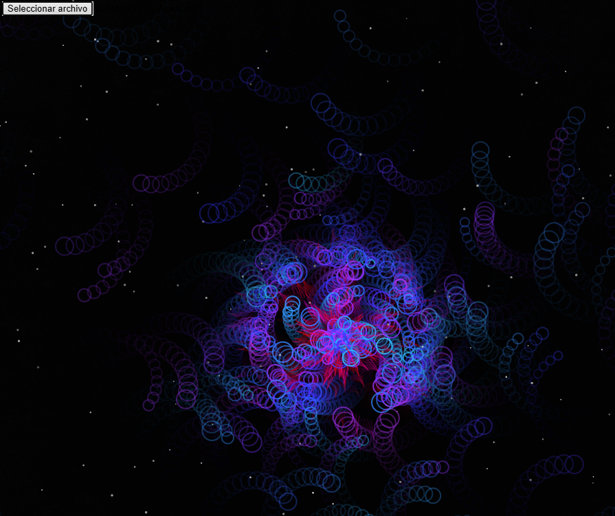
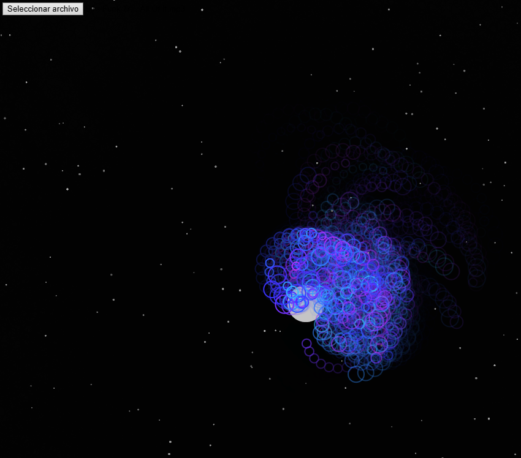
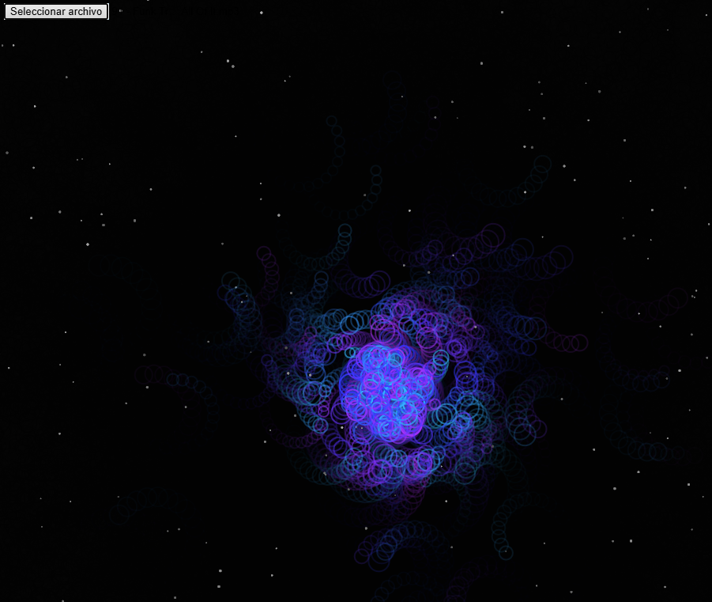

# Obra de arte generativa algorítmica interactiva en tiempo real
### Galaxia Sensorial
La obra **“Galaxia Sensorial”** es una experiencia generativa e interactiva creada en p5.js que busca simular una galaxia viva que reacciona al sonido en tiempo real. Inspirada en el estilo visual de Refik Anadol, la propuesta busca mezclar arte generativo, análisis de audio y principios de programación creativa para lograr una atmósfera inmersiva, envolvente y sensible a diferentes estímulos musicales.


Desde el inicio, la idea fue crear un sistema de partículas que no solo respondiera a una canción cargada por el usuario, sino que también lo hiciera de forma distinta según el tipo de música. Para lograrlo, se utilizó análisis FFT para obtener niveles de energía en bajos, medios y agudos, y a partir de eso se definió la aparición y comportamiento de tres tipos distintos de partículas. Cada canción produce una constelación única. Por ejemplo, una canción con muchos agudos genera más trazos largos de luz que atraviesan la galaxia, mientras que una canción con graves produce espirales lentas que giran desde el centro.


Se aplicaron los conceptos de **herencia y polimorfismo** creando tres clases de partículas: `SpiralParticle`, `PulseParticle` y `TrailParticle`, todas con comportamiento visual y dinámico diferente. Cada clase responde a un rango distinto de frecuencias: bajos, medios o agudos. Las partículas también responden a fuerzas simuladas, como la atracción hacia el centro y la repulsión con el mouse, mostrando cómo las fuerzas afectan el movimiento. Además, se creó un fondo dinámico compuesto por estrellas que titilan con leves movimientos y variaciones de brillo, generando una segunda capa visual que aporta profundidad e inmersión.


Durante la construcción se aplicó al menos un concepto de cada unidad vista en el curso. De la **Unidad 1**, se usó aleatoriedad (`random()`) y vectores para definir el comportamiento inicial y las direcciones de movimiento. De la **Unidad 2**, se incorporaron fuerzas personalizadas, incluyendo una repulsión generada por el mouse. De la **Unidad 3**, se integró el concepto de oscilación, haciendo que algunas partículas giren suavemente usando funciones `sin()` para simular movimiento orbital. Por último, se empleó el uso del micrófono (en este caso, una canción cargada por el usuario), haciendo uso del análisis de frecuencia para generar una respuesta visual única a cada tema.

La obra también tiene interacciones adicionales: el usuario puede hacer clic para activar un pequeño campo de repulsión que aleja ciertas partículas, o puede presionar la tecla `S` para activar un modo de cámara lenta donde todos los movimientos y efectos se ralentizan, permitiendo observar el comportamiento del sistema con más detalle. La tecla `R` genera una lluvia intensa de partículas tipo `TrailParticle`, creando un efecto de aceleración visual.


La gestión de memoria y vida de partículas se realiza con un sistema de `lifespan`. Cada partícula pierde vida con el tiempo y se elimina automáticamente del arreglo cuando ya no es visible, asegurando que el sistema se mantenga eficiente sin importar la duración de la sesión.


En conclusión, **“Galaxia Sensorial”** es una instalación visual viva que mezcla música, color, movimiento y código. Responde a diferentes estímulos sonoros de manera orgánica, permitiendo una exploración visual que cambia con cada canción. Este proyecto es una integración completa de los conocimientos adquiridos en las unidades anteriores y un punto de partida para seguir explorando el arte generativo como herramienta expresiva, inmersiva y dinámica.

### Código
```js
// 🌌 Galaxia Musical Interactiva - Versión Final con Fondo Estelar

let song;
let fft;
let particles = [];
let backgroundStars = [];
let galaxyCenter;
let playButton;
let slowMotion = false;
let repulsor = null;
let slowMotionFactor = 1;

function setup() {
  createCanvas(1000, 1000);
  colorMode(HSB, 360, 100, 100, 100);
  angleMode(DEGREES);
  galaxyCenter = createVector(width / 2, height / 2);
  fft = new p5.FFT();
  playButton = createFileInput(handleFile);
  playButton.position(10, 10);

  // Crear fondo estelar
  for (let i = 0; i < 200; i++) {
    backgroundStars.push(new Star(random(width), random(height)));
  }
}

function handleFile(file) {
  if (file.type === 'audio') {
    if (song && song.isPlaying()) song.stop();
    song = loadSound(file.data, () => song.play());
  }
}

function draw() {
  background(0, 0, 0, 20);
  if (!song) return;

  let spectrum = fft.analyze();
  let bass = fft.getEnergy("bass");
  let mid = fft.getEnergy("mid");
  let treble = fft.getEnergy("treble");
  let energy = (bass + mid + treble) / 3;

  // Dibujar fondo estelar reactivo
  for (let star of backgroundStars) {
    star.update(energy);
    star.show();
  }

  if (frameCount % int(2 * slowMotionFactor) === 0) {
    let total = map(energy, 0, 255, 1, 5);

    for (let i = 0; i < total; i++) {
      let dominant = max(bass, mid, treble);
      if (dominant === bass) {
        particles.push(new SpiralParticle(galaxyCenter.x, galaxyCenter.y));
      } else if (dominant === mid) {
        particles.push(new PulseParticle(galaxyCenter.x, galaxyCenter.y));
      } else {
        particles.push(new TrailParticle(galaxyCenter.x, galaxyCenter.y));
      }
    }
  }

  if (repulsor) {
    fill(0, 0, 100, 40);
    noStroke();
    circle(repulsor.x, repulsor.y, 60);
  }

  for (let i = particles.length - 1; i >= 0; i--) {
    let p = particles[i];
    p.applyAudio(bass, mid, treble);
    if (repulsor && p.repellable) {
      let dir = p5.Vector.sub(p.position, repulsor);
      let d = dir.mag();
      if (d < 50) {
        dir.setMag(2);
        p.applyForce(dir);
      }
    }
    p.update();
    p.show();
    if (p.isDead()) particles.splice(i, 1);
  }
}

function mousePressed() {
  repulsor = createVector(mouseX, mouseY);
}

function mouseReleased() {
  repulsor = null;
}

function keyPressed() {
  if (key === 'S') slowMotion = !slowMotion;
  slowMotionFactor = slowMotion ? 2 : 1;
  if (key === 'R') {
    for (let i = 0; i < 40; i++) {
      particles.push(new TrailParticle(galaxyCenter.x, galaxyCenter.y));
    }
  }
}

class Star {
  constructor(x, y) {
    this.position = createVector(x, y);
    this.baseBrightness = random(20, 60);
    this.size = random(1, 3);
    this.offset = random(1000);
  }

  update(energy) {
    this.brightness = this.baseBrightness + map(noise(this.offset + frameCount * 0.01), 0, 1, -10, 10) + map(energy, 0, 255, 0, 20);
  }

  show() {
    noStroke();
    fill(0, 0, this.brightness, 90);
    circle(this.position.x, this.position.y, this.size);
  }
}

class SpiralParticle {
  constructor(x, y) {
    this.position = createVector(x, y);
    let angle = random(360);
    let speed = random(1, 3);
    this.velocity = p5.Vector.fromAngle(radians(angle)).mult(speed);
    this.acceleration = createVector(0, 0);
    this.lifespan = 255;
    this.size = random(4, 10);
    this.hue = random(200, 280);
    this.repellable = true;
  }

  applyForce(force) {
    this.acceleration.add(force);
  }

  applyAudio(bass, mid, treble) {
    let mag = map(bass, 0, 255, 0, 0.3);
    let dir = p5.Vector.sub(this.position, galaxyCenter).normalize().mult(mag);
    this.applyForce(dir);
  }

  update() {
    this.velocity.mult(1 / slowMotionFactor);
    this.velocity.rotate(sin(frameCount * 0.5) * 0.3);
    this.velocity.add(this.acceleration);
    this.position.add(this.velocity);
    this.acceleration.mult(0);
    this.lifespan -= 2 / slowMotionFactor;
  }

  isDead() {
    return this.lifespan < 0;
  }

  show() {
    noFill();
    stroke(this.hue, 80, 100, this.lifespan * 0.4);
    strokeWeight(2);
    ellipse(this.position.x, this.position.y, this.size * 3);
  }
}

class PulseParticle extends SpiralParticle {
  constructor(x, y) {
    super(x, y);
    this.hue = random(40, 100);
  }

  applyAudio(bass, mid, treble) {
    this.size = map(mid, 0, 255, 5, 25);
    this.hue = (this.hue + 2) % 360;
  }

  show() {
    noStroke();
    fill(this.hue, 100, 100, this.lifespan * 0.5);
    circle(this.position.x, this.position.y, this.size);
  }
}

class TrailParticle extends SpiralParticle {
  constructor(x, y) {
    super(x, y);
    this.hue = random(300, 360);
    this.repellable = false;
  }

  applyAudio(bass, mid, treble) {
    this.size = map(treble, 0, 255, 5, 20);
  }

  show() {
    stroke(this.hue, 100, 100, this.lifespan * 0.4);
    strokeWeight(1.5);
    line(this.position.x, this.position.y, this.position.x - this.velocity.x * 10, this.position.y - this.velocity.y * 10);
  }
}

```
[Galaxia sensorial](https://editor.p5js.org/tiago123fk/sketches/YQoEL9T4O)

### Imágenes
#### 1

#### 2

#### 3

