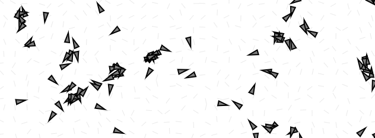

# Analizando los campos de flujo (flow fields)
### Estructura del Campo de Flujo
**¿Qué estructura de datos se usa?**

-   Se usa un arreglo bidimensional (array 2D):
```js
this.field = new Array(this.cols);
for (let i = 0; i < this.cols; i++) {
  this.field[i] = new Array(this.rows);
}

```
Cada posición `field[i][j]` guarda un vector (`p5.Vector`).


**¿Qué representa cada elemento?**

-   Cada vector indica una dirección dentro de la celda `(i,j)`.  
    Es como una "brújula" para los vehículos en ese punto.
    

 **¿Cómo se generan los vectores?**

-   Se usa Perlin noise para calcular un ángulo, de forma suave:
```js
let angle = map(noise(xoff, yoff), 0, 1, 0, TWO_PI);
this.field[i][j] = p5.Vector.fromAngle(angle);
```
Así el campo no es aleatorio loco, sino que tiene transiciones suaves.

### Comportamiento del Agente (Clase `Vehicle`)
**¿Cómo el agente determina qué vector debe seguir?**  
En `follow(flow)`, usando su posición:
```js
let desired = flow.lookup(this.position);
```
En `lookup(position)`, se convierte la posición `(x,y)` a índices de la cuadrícula:
```js
let column = constrain(floor(position.x / this.resolution), 0, this.cols - 1);
let row = constrain(floor(position.y / this.resolution), 0, this.rows - 1);
return this.field[column][row].copy();
```
Es decir: posición en píxeles → celda del campo.


**¿Cómo usa el vector deseado?**

-   Ajusta el vector del flowfield a su velocidad máxima (`maxspeed`).
    
-   Calcula un steering force:
```js
desired.mult(this.maxspeed);
let steer = p5.Vector.sub(desired, this.velocity);
steer.limit(this.maxforce);
this.applyForce(steer);
```
Aplica la fuerza que modifica su aceleración.

### Parámetros Clave

| Parámetro | Donde aparece |Qué controla|
|--|--|--|
|  `resolution`|  `flowfield = new FlowField(20);`|Tamaño de cada celda del campo.|
|`maxspeed`|En `new Vehicle(x,y,random(2,5),random(0.1,0.5))`|Máxima velocidad de cada agente.
|`maxforce`|También al crear el `Vehicle`|Máxima fuerza de dirección (steering)


**`resolution`**


Define el tamaño de las celdas de la cuadrícula del campo de flujo. Un valor menor genera un campo más detallado; uno mayor genera un campo más simple.


**`maxspeed`**


Controla la velocidad máxima a la que puede moverse un agente. Velocidades más altas generan movimientos más agresivos y erráticos.


**`maxforce`**


Limita la fuerza máxima que un agente puede aplicar para cambiar de dirección. Valores más bajos hacen que los cambios de dirección sean más suaves y naturales.


#### Otros parámetros clave

**`vehicles.length`**


Afecta cuántos agentes hay moviéndose simultáneamente, impactando la densidad visual de la escena.


**`xoff/yoff step` en `init()`**


Define la suavidad o turbulencia del campo de flujo. Pasos más pequeños generan cambios más lentos y suaves; pasos más grandes generan cambios bruscos.


### Experimenta con modificaciones
En esta actividad se experimentó con modificaciones significativas en la generación del campo de flujo (flow field), basadas en el ejemplo del libro **“The Nature of Code”** de Daniel Shiffman.


El objetivo fue observar cómo cambios en reglas simples pueden alterar profundamente el comportamiento emergente de los agentes en movimiento.


Se realizaron dos experimentaciones:

-   Una basada en **ángulos completamente aleatorios**.
    
-   Otra basada en **ruido Perlin altamente distorsionado**.

#### Experimentación 1: Ángulos Aleatorios

**Modificación realizada:**  
Se alteró la función de generación de vectores en el campo de flujo.  


En lugar de usar `noise()`, se asignó un **ángulo aleatorio** a cada celda


**Efecto observado:**

-   El movimiento de los vehículos se volvió extremadamente errático y caótico.
    
-   Cada agente seguía trayectorias impredecibles, realizando cambios de dirección bruscos y constantes.
    
-   Cada vez que se hacía click, el patrón del flow field cambiaba radicalmente.
    
-   Visualmente, el sistema parecía un enjambre desordenado sin ninguna dirección dominante.

#### Experimentación 2: Noise Distorsionado

**Modificación realizada:**  
Se mantuvo el uso de **noise()**, pero se distorsionó significativamente:

-   Multiplicando `xoff` y `yoff` por `10` para alterar la frecuencia.
    
-   Expandiendo el rango de ángulos a `4 * PI` (dos vueltas completas).


**Efecto observado:**

-   El movimiento de los agentes seguía siendo relativamente suave gracias a `noise()`, pero con cambios de dirección mucho más frecuentes y abruptos.
    
-   Los vehículos parecían nerviosos, como si reaccionaran constantemente a perturbaciones del entorno.
    
-   Cada click generaba un flow field altamente diferente, pero conservando ciertas zonas de coherencia local.
    
-   Visualmente, se percibía un sistema complejo e impredecible, aunque menos "salvaje" que en la opción aleatoria.

#### Código
```js
// The Nature of Code
// Daniel Shiffman (modificado)

// Flow Field Following - Dos experimentos de modificación

// Modo de modificación: 1 = Ángulos aleatorios, 2 = Noise distorsionado
let modo = 1; 

class FlowField {
  constructor(r) {
    this.resolution = r;
    this.cols = width / this.resolution;
    this.rows = height / this.resolution;
    this.field = new Array(this.cols);
    for (let i = 0; i < this.cols; i++) {
      this.field[i] = new Array(this.rows);
    }
    this.init();
  }

  init() {
    noiseSeed(random(10000)); // Para que sí cambie con click
    let xoff = 0;
    for (let i = 0; i < this.cols; i++) {
      let yoff = 0;
      for (let j = 0; j < this.rows; j++) {

        let angle;
        if (modo === 1) {
          // 🔥 Modo 1: Ángulos totalmente aleatorios
          angle = random(TWO_PI);
        } else if (modo === 2) {
          // 🔥 Modo 2: Noise distorsionado
          angle = map(noise(xoff * 10, yoff * 10), 0, 1, 0, TWO_PI * 4);
        }

        this.field[i][j] = p5.Vector.fromAngle(angle);
        yoff += 0.1;
      }
      xoff += 0.1;
    }
  }

  show() {
    for (let i = 0; i < this.cols; i++) {
      for (let j = 0; j < this.rows; j++) {
        let w = width / this.cols;
        let h = height / this.rows;
        let v = this.field[i][j].copy();
        v.setMag(w * 0.5);
        let x = i * w + w / 2;
        let y = j * h + h / 2;
        strokeWeight(1);
        stroke(200, 100);
        line(x, y, x + v.x, y + v.y);
      }
    }
  }

  lookup(position) {
    let column = constrain(floor(position.x / this.resolution), 0, this.cols - 1);
    let row = constrain(floor(position.y / this.resolution), 0, this.rows - 1);
    return this.field[column][row].copy();
  }
}

// Variables principales
let debug = true;
let flowfield;
let vehicles = [];

function setup() {
  let text = createP(
    "Presiona barra espaciadora para mostrar/ocultar el flow field.<br>Haz click para regenerar un nuevo campo de flujo."
  );

  createCanvas(640, 240);
  flowfield = new FlowField(20);
  for (let i = 0; i < 120; i++) {
    vehicles.push(
      new Vehicle(random(width), random(height), random(2, 5), random(0.1, 0.5))
    );
  }
}

function draw() {
  background(255);

  if (debug) flowfield.show();

  for (let i = 0; i < vehicles.length; i++) {
    vehicles[i].follow(flowfield);
    vehicles[i].run();
  }
}

function keyPressed() {
  if (key == " ") {
    debug = !debug;
  }
}

function mousePressed() {
  flowfield.init();
}

// Clase Vehicle
class Vehicle {
  constructor(x, y, ms, mf) {
    this.position = createVector(x, y);
    this.acceleration = createVector(0, 0);
    this.velocity = createVector(0, 0);
    this.r = 4;
    this.maxspeed = ms;
    this.maxforce = mf;
  }

  run() {
    this.update();
    this.borders();
    this.show();
  }

  follow(flow) {
    let desired = flow.lookup(this.position);
    desired.mult(this.maxspeed);
    let steer = p5.Vector.sub(desired, this.velocity);
    steer.limit(this.maxforce);
    this.applyForce(steer);
  }

  applyForce(force) {
    this.acceleration.add(force);
  }

  update() {
    this.velocity.add(this.acceleration);
    this.velocity.limit(this.maxspeed);
    this.position.add(this.velocity);
    this.acceleration.mult(0);
  }

  borders() {
    if (this.position.x < -this.r) this.position.x = width + this.r;
    if (this.position.y < -this.r) this.position.y = height + this.r;
    if (this.position.x > width + this.r) this.position.x = -this.r;
    if (this.position.y > height + this.r) this.position.y = -this.r;
  }

  show() {
    let theta = this.velocity.heading();
    fill(127);
    stroke(0);
    strokeWeight(2);
    push();
    translate(this.position.x, this.position.y);
    rotate(theta);
    beginShape();
    vertex(this.r * 2, 0);
    vertex(-this.r * 2, -this.r);
    vertex(-this.r * 2, this.r);
    endShape(CLOSE);
    pop();
  }
}

```
Al inicio se escoge que modo usar  
### Imágenes
#### 1

#### 2


### Conclusión

Estos experimentos demuestran cómo pequeños cambios en las reglas locales de un sistema pueden producir variaciones radicales en el comportamiento emergente.

-   El sistema pasó de un movimiento fluido y natural, a un caos desordenado (ángulos aleatorios).
    
-   Y también a un nerviosismo controlado (noise distorsionado).
    

Esta exploración refuerza la idea central de los agentes autónomos: de reglas simples, emergen comportamientos complejos y ricos visualmente, esenciales para el arte generativo.
