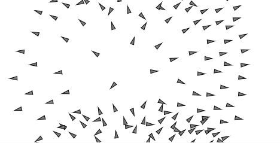

# Analizando el comportamiento de enjambre (Flocking)
### Análisis de las Reglas de Flocking
#### Separación (Separation)

**Objetivo:**  
Evitar que los boids (agentes) se acerquen demasiado unos a otros,  evitando colisiones y manteniendo una distancia mínima.


**¿Cómo calcula la fuerza de dirección?**

-   Recorre todos los demás boids.
    
-   Si otro boid está dentro de un radio de separación (`desiredSeparation = 25`),  
    calcula un vector que apunta lejos de ese vecino.
    
-   Promedia todos esos vectores de separación.
    
-   Normaliza y ajusta la fuerza para que no sea exagerada (`limit(this.maxforce)`).

#### Alineación (Alignment)

**Objetivo:**  


Lograr que los boids se muevan en la misma dirección promedio que sus vecinos cercanos.


**¿Cómo calcula la fuerza de dirección?**

-   Recorre los vecinos dentro de un radio (`neighborDistance = 50`).
    
-   Suma las velocidades de esos vecinos.
    
-   Calcula la velocidad promedio deseada.
    
-   Ajusta su propia velocidad para acercarse a esa dirección promedio.

#### Cohesión (Cohesion)

**Objetivo:**  


Hacer que los boids se acerquen al centro de masa de sus vecinos cercanos, formando grupos compactos.


**¿Cómo calcula la fuerza de dirección?**

-   Recorre los vecinos dentro de un radio (`neighborDistance = 50`).
    
-   Suma las posiciones de los vecinos.
    
-   Calcula el centro promedio.
    
-   Calcula un vector que apunta hacia ese centro promedio usando la función `seek(sum)`.

###  Parámetros Clave Identificados

| Parámetro          | Descripción |
|:-------------------|:------------|
| `desiredSeparation` | Radio para mantener distancia mínima en separación (`25`). |
| `neighborDistance`  | Radio para considerar vecinos en alineación y cohesión (`50`). |
| `sep.mult(1.5)`     | Peso de la fuerza de separación. |
| `ali.mult(1.0)`     | Peso de la fuerza de alineación. |
| `coh.mult(1.0)`     | Peso de la fuerza de cohesión. |
| `maxspeed`          | Velocidad máxima de cada boid (`3`). |
| `maxforce`          | Fuerza máxima de steering de cada boid (`0.05`). |


### Modificación Experimental
**Modificación elegida:** Cambiar drásticamente el peso de una regla, **desactivar la cohesión** (poner `coh.mult(0)`).


#### Efecto Observado

-   **Comportamiento sin cohesión:**  
    Los boids dejan de formar grupos compactos.  
    Aunque siguen tratando de no chocar (separación) y de moverse más o menos en la misma dirección (alineación), ya no buscan estar juntos.
    
-   **Visualmente:**
    
    -   El enjambre se dispersa más.
        
    -   No se forman "nubes" ni "bandadas" como antes.
        
    -   Parecen un conjunto de partículas individuales que van en direcciones parecidas pero sin mantenerse unidas.

#### Código
```js
// The Nature of Code
// Daniel Shiffman (modificado)

// Boid class
class Boid {
  constructor(x, y) {
    this.acceleration = createVector(0, 0);
    this.velocity = createVector(random(-1, 1), random(-1, 1));
    this.position = createVector(x, y);
    this.r = 3.0;
    this.maxspeed = 3; // Velocidad máxima
    this.maxforce = 0.05; // Máxima fuerza de steering
  }

  run(boids) {
    this.flock(boids);
    this.update();
    this.borders();
    this.show();
  }

  applyForce(force) {
    this.acceleration.add(force);
  }

  flock(boids) {
    let sep = this.separate(boids); // Separación
    let ali = this.align(boids);    // Alineación
    let coh = this.cohere(boids);   // Cohesión

    // Modificación: Apagamos cohesión
    sep.mult(1.5);
    ali.mult(1.0);
    coh.mult(0); // Cohesión desactivada

    this.applyForce(sep);
    this.applyForce(ali);
    this.applyForce(coh);
  }

  update() {
    this.velocity.add(this.acceleration);
    this.velocity.limit(this.maxspeed);
    this.position.add(this.velocity);
    this.acceleration.mult(0);
  }

  seek(target) {
    let desired = p5.Vector.sub(target, this.position);
    desired.normalize();
    desired.mult(this.maxspeed);
    let steer = p5.Vector.sub(desired, this.velocity);
    steer.limit(this.maxforce);
    return steer;
  }

  show() {
    let angle = this.velocity.heading();
    fill(127);
    stroke(0);
    push();
    translate(this.position.x, this.position.y);
    rotate(angle);
    beginShape();
    vertex(this.r * 2, 0);
    vertex(-this.r * 2, -this.r);
    vertex(-this.r * 2, this.r);
    endShape(CLOSE);
    pop();
  }

  borders() {
    if (this.position.x < -this.r) this.position.x = width + this.r;
    if (this.position.y < -this.r) this.position.y = height + this.r;
    if (this.position.x > width + this.r) this.position.x = -this.r;
    if (this.position.y > height + this.r) this.position.y = -this.r;
  }

  separate(boids) {
    let desiredSeparation = 25;
    let steer = createVector(0, 0);
    let count = 0;

    for (let i = 0; i < boids.length; i++) {
      let d = p5.Vector.dist(this.position, boids[i].position);
      if (d > 0 && d < desiredSeparation) {
        let diff = p5.Vector.sub(this.position, boids[i].position);
        diff.normalize();
        diff.div(d);
        steer.add(diff);
        count++;
      }
    }
    if (count > 0) {
      steer.div(count);
    }

    if (steer.mag() > 0) {
      steer.normalize();
      steer.mult(this.maxspeed);
      steer.sub(this.velocity);
      steer.limit(this.maxforce);
    }
    return steer;
  }

  align(boids) {
    let neighborDistance = 50;
    let sum = createVector(0, 0);
    let count = 0;

    for (let i = 0; i < boids.length; i++) {
      let d = p5.Vector.dist(this.position, boids[i].position);
      if (d > 0 && d < neighborDistance) {
        sum.add(boids[i].velocity);
        count++;
      }
    }
    if (count > 0) {
      sum.div(count);
      sum.normalize();
      sum.mult(this.maxspeed);
      let steer = p5.Vector.sub(sum, this.velocity);
      steer.limit(this.maxforce);
      return steer;
    } else {
      return createVector(0, 0);
    }
  }

  cohere(boids) {
    let neighborDistance = 50;
    let sum = createVector(0, 0);
    let count = 0;

    for (let i = 0; i < boids.length; i++) {
      let d = p5.Vector.dist(this.position, boids[i].position);
      if (d > 0 && d < neighborDistance) {
        sum.add(boids[i].position);
        count++;
      }
    }
    if (count > 0) {
      sum.div(count);
      return this.seek(sum);
    } else {
      return createVector(0, 0);
    }
  }
}

// Flock class
class Flock {
  constructor() {
    this.boids = [];
  }

  run() {
    for (let boid of this.boids) {
      boid.run(this.boids);
    }
  }

  addBoid(b) {
    this.boids.push(b);
  }
}

// Main sketch
let flock;

function setup() {
  createCanvas(640, 240);
  flock = new Flock();
  for (let i = 0; i < 120; i++) {
    let boid = new Boid(width / 2, height / 2);
    flock.addBoid(boid);
  }
}

function draw() {
  background(255);
  flock.run();
}

function mouseDragged() {
  flock.addBoid(new Boid(mouseX, mouseY));
}

``` 
**Cuando corras este código:**

-   Vas a ver que los boids se mantienen relativamente separados y alineados, pero ya no forman grupos.
    
-   Si haces `mouseDragged`, puedes agregar más boids manualmente.

#### Imagen

