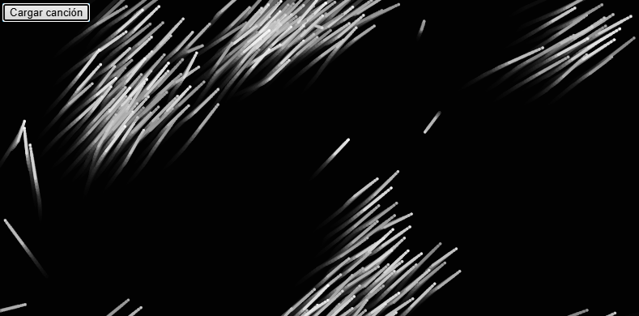

# Aplicación creativa e inesperada de agentes autónomos

### Algoritmo elegido
**Flocking** (comportamiento de enjambre) adaptado de "The Nature of Code" de Daniel Shiffman.

### Concepto Creativo: "Constelación Viva - Rave Techno"
Transformamos el flocking tradicional en un enjambre minimalista de partículas blancas y grises que reaccionan en tiempo real a la música electrónica.  


Cada boid representa una estrella fugaz de un cielo techno:  
- Vibran, titilan y generan estelas vivas sincronizadas con los beats de la canción.  
- El ritmo controla su movimiento, tamaño y la generación de nuevos boids.


**Estilo visual:**  
- Fondo negro total con rastro de estelas.  
- Boids en blanco y grises (minimalismo techno, estética rave).

### Adaptaciones y Cambios
- Se permitió al usuario subir su propia canción (`createFileInput`).
- Usamos p5.Amplitude para detectar la energía musical en tiempo real.
- Boids vibran cambiando su tamaño (`strokeWeight`) según el beat.
- Se generan nuevos boids automáticamente con beats fuertes.
- Máximo 300 boids activos para evitar saturación; los más antiguos se eliminan dinámicamente.
- **Mouse:** repele boids al acercarse.
- **Click:** añade mini explosiones de boids.

### Interacción implementada
- **Subir canción** → visualización empieza.
- **Mouse cerca:** boids huyen.
- **Click:** se agregan más boids en la posición.
- **Tecla 'A':** añade manualmente boids en el mouse.

###  Código completo
```js
// Arte Generativo: Flocking Minimalista de Estrellas Reaccionando al Techno

let flock;
let song;
let amplitude;
let button;
let started = false;

function preload() {
  // Nada porque el usuario carga su canción
}

function setup() {
  createCanvas(800, 400);
  background(0);
  flock = new Flock();

  button = createButton('Cargar canción');
  button.position(10, 10);
  button.mousePressed(handleFile);

  textAlign(CENTER, CENTER);
  textSize(16);
  fill(255);
}

function draw() {
  background(0, 50); // Fondo con efecto rastro

  if (started) {
    let level = amplitude.getLevel();

    // Crear nuevos boids si la energía pasa un umbral
    if (level > 0.2 && frameCount % 10 === 0 && flock.boids.length < 300) {
      flock.addBoid(new Boid(random(width), random(height)));
    }

    // Ajustar propiedades de boids según la energía
    for (let boid of flock.boids) {
      boid.maxspeed = 3 + level * 10;
      boid.dynamicWeight = map(level, 0, 0.3, 1, 5); // Vibración visual
    }

    // Limitar cantidad de boids
    if (flock.boids.length > 300) {
      flock.boids.splice(0, flock.boids.length - 300);
    }

    flock.run();
  } else {
    text('Sube una canción para comenzar 🎵', width/2, height/2);
  }
}

function handleFile() {
  let fileInput = createFileInput(function(file){
    if (file.type === 'audio') {
      if (song) {
        song.stop();
      }
      song = loadSound(file.data, startSong);
    }
  });
  fileInput.hide();
  fileInput.elt.click();
}

function startSong() {
  song.play();
  amplitude = new p5.Amplitude();
  amplitude.setInput(song);
  started = true;
  for (let i = 0; i < 20; i++) {
    flock.addBoid(new Boid(random(width), random(height)));
  }
}

function keyPressed() {
  if (key === 'A' || key === 'a') {
    for (let i = 0; i < 5; i++) {
      if (flock.boids.length < 300) {
        flock.addBoid(new Boid(mouseX, mouseY));
      }
    }
  }
}

function mousePressed() {
  if (started) {
    for (let i = 0; i < 10; i++) {
      if (flock.boids.length < 300) {
        flock.addBoid(new Boid(mouseX, mouseY));
      }
    }
  }
}

// Clase Boid adaptada para minimal techno
class Boid {
  constructor(x, y) {
    this.acceleration = createVector(0, 0);
    this.velocity = p5.Vector.random2D();
    this.velocity.mult(random(2, 4));
    this.position = createVector(x, y);
    this.r = 2.5;
    this.maxspeed = 4;
    this.maxforce = 0.05;
    this.dynamicWeight = 2;
    this.color = color(random(150, 255)); // Grises
  }

  run(boids) {
    this.flock(boids);
    this.update();
    this.borders();
    this.show();
  }

  applyForce(force) {
    this.acceleration.add(force);
  }

  flock(boids) {
    let sep = this.separate(boids);
    let ali = this.align(boids);
    let coh = this.cohere(boids);

    sep.mult(1.5);
    ali.mult(1.0);
    coh.mult(1.0);

    this.applyForce(sep);
    this.applyForce(ali);
    this.applyForce(coh);

    let mouse = createVector(mouseX, mouseY);
    let d = dist(this.position.x, this.position.y, mouse.x, mouse.y);
    if (d < 100) {
      let flee = p5.Vector.sub(this.position, mouse);
      flee.normalize();
      flee.mult(0.5);
      this.applyForce(flee);
    }
  }

  update() {
    this.velocity.add(this.acceleration);
    this.velocity.limit(this.maxspeed);
    this.position.add(this.velocity);
    this.acceleration.mult(0);
  }

  seek(target) {
    let desired = p5.Vector.sub(target, this.position);
    desired.normalize();
    desired.mult(this.maxspeed);
    let steer = p5.Vector.sub(desired, this.velocity);
    steer.limit(this.maxforce);
    return steer;
  }

  show() {
    stroke(this.color);
    strokeWeight(this.dynamicWeight);
    point(this.position.x, this.position.y);
    stroke(this.color.levels[0], 150);
    line(this.position.x, this.position.y,
         this.position.x - this.velocity.x * 10,
         this.position.y - this.velocity.y * 10);
  }

  borders() {
    if (this.position.x < -this.r) this.position.x = width + this.r;
    if (this.position.y < -this.r) this.position.y = height + this.r;
    if (this.position.x > width + this.r) this.position.x = -this.r;
    if (this.position.y > height + this.r) this.position.y = -this.r;
  }

  separate(boids) {
    let desiredSeparation = 20;
    let steer = createVector(0, 0);
    let count = 0;
    for (let other of boids) {
      let d = p5.Vector.dist(this.position, other.position);
      if ((d > 0) && (d < desiredSeparation)) {
        let diff = p5.Vector.sub(this.position, other.position);
        diff.normalize();
        diff.div(d);
        steer.add(diff);
        count++;
      }
    }
    if (count > 0) {
      steer.div(count);
    }
    if (steer.mag() > 0) {
      steer.normalize();
      steer.mult(this.maxspeed);
      steer.sub(this.velocity);
      steer.limit(this.maxforce);
    }
    return steer;
  }

  align(boids) {
    let neighborDist = 50;
    let sum = createVector(0, 0);
    let count = 0;
    for (let other of boids) {
      let d = p5.Vector.dist(this.position, other.position);
      if ((d > 0) && (d < neighborDist)) {
        sum.add(other.velocity);
        count++;
      }
    }
    if (count > 0) {
      sum.div(count);
      sum.normalize();
      sum.mult(this.maxspeed);
      let steer = p5.Vector.sub(sum, this.velocity);
      steer.limit(this.maxforce);
      return steer;
    } else {
      return createVector(0, 0);
    }
  }

  cohere(boids) {
    let neighborDist = 50;
    let sum = createVector(0, 0);
    let count = 0;
    for (let other of boids) {
      let d = p5.Vector.dist(this.position, other.position);
      if ((d > 0) && (d < neighborDist)) {
        sum.add(other.position);
        count++;
      }
    }
    if (count > 0) {
      sum.div(count);
      return this.seek(sum);
    } else {
      return createVector(0, 0);
    }
  }
}

class Flock {
  constructor() {
    this.boids = [];
  }

  run() {
    for (let boid of this.boids) {
      boid.run(this.boids);
    }
  }

  addBoid(b) {
    this.boids.push(b);
  }
}


```
[Visualización generativa ](https://editor.p5js.org/tiago123fk/sketches/RzLQ7qRuV)

### Imagen

