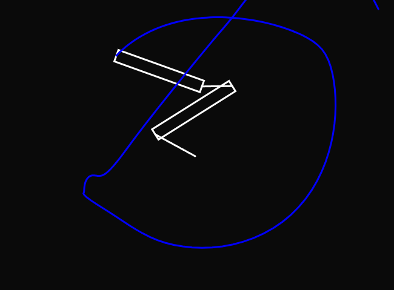
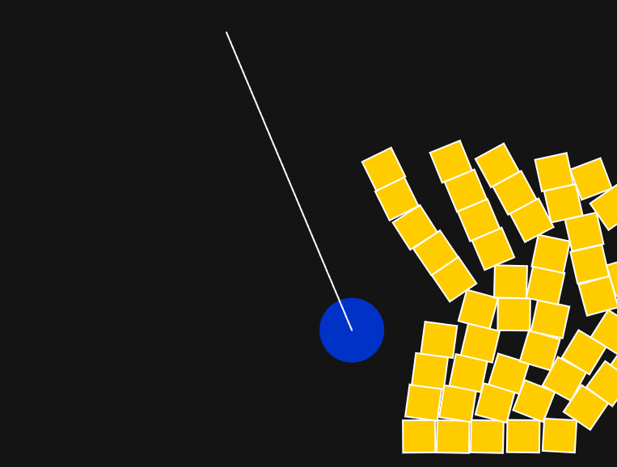

# Investigación y experimentación con Matter.js

### Identifica conceptos clave
-   **Engine**: motor físico que gestiona la simulación (gravedad, colisiones).
    
-   **World**: contenedor del mundo físico. Aquí se agregan los cuerpos y restricciones.
    
-   **Bodies**: los objetos físicos como círculos, rectángulos o polígonos. Tienen propiedades como masa, fricción y rebote.
    
-   **Constraint**: sirve para conectar dos cuerpos o un cuerpo con un punto fijo, como si fuera una cuerda o articulación.
    
-   **MouseConstraint**: permite interactuar con los cuerpos usando el mouse (arrastrar, soltar, aplicar fuerza).

### Código: Brazo articulado con trazo
Dos rectángulos conectados con constraints actuando como un brazo. El punto final del segundo brazo deja un rastro de colores usando un array de puntos, lo que visualiza el movimiento como una animación física dinámica.

```js
// Requiere que hayas cargado Matter.js en tu index.html

let Engine = Matter.Engine,
    Render = Matter.Render,
    World = Matter.World,
    Bodies = Matter.Bodies,
    Constraint = Matter.Constraint,
    Mouse = Matter.Mouse,
    MouseConstraint = Matter.MouseConstraint;

let engine;
let world;
let arm1, arm2;
let joint1, joint2;
let trace = [];

function setup() {
  createCanvas(800, 600);
  engine = Engine.create();
  world = engine.world;
  engine.gravity.y = 0;

  // Brazo 1
  arm1 = Bodies.rectangle(400, 300, 150, 20, {
    collisionFilter: { group: -1 },
    frictionAir: 0.02
  });

  // Brazo 2
  arm2 = Bodies.rectangle(500, 300, 150, 20, {
    collisionFilter: { group: -1 },
    frictionAir: 0.02
  });

  // Unión brazo 1 al centro
  joint1 = Constraint.create({
    pointA: { x: 400, y: 300 },
    bodyB: arm1,
    pointB: { x: -75, y: 0 },
    stiffness: 1
  });

  // Unión brazo 1 con brazo 2
  joint2 = Constraint.create({
    bodyA: arm1,
    pointA: { x: 75, y: 0 },
    bodyB: arm2,
    pointB: { x: -75, y: 0 },
    stiffness: 1
  });

  World.add(world, [arm1, arm2, joint1, joint2]);

  // Mouse
  const canvasMouse = Mouse.create(canvas.elt);
  const options = {
    mouse: canvasMouse
  };
  const mConstraint = MouseConstraint.create(engine, options);
  World.add(world, mConstraint);
}

function draw() {
  background(10);
  Engine.update(engine);

  // Dibujar brazos
  drawBody(arm1);
  drawBody(arm2);

  // Dibujar articulaciones
  stroke(255);
  strokeWeight(3);
  line(joint1.pointA.x, joint1.pointA.y, 
       arm1.position.x + joint1.pointB.x, 
       arm1.position.y + joint1.pointB.y);

  line(arm1.position.x + joint2.pointA.x,
       arm1.position.y + joint2.pointA.y,
       arm2.position.x + joint2.pointB.x,
       arm2.position.y + joint2.pointB.y);

  // Rastro del extremo del brazo 2
  let tipX = arm2.position.x + 75 * cos(arm2.angle);
  let tipY = arm2.position.y + 75 * sin(arm2.angle);
  trace.push({ x: tipX, y: tipY });

  noFill();
  beginShape();
  for (let i = 0; i < trace.length; i++) {
    stroke(lerpColor(color('red'), color('blue'), i / trace.length));
    vertex(trace[i].x, trace[i].y);
  }
  endShape();

  // Limitar largo del rastro
  if (trace.length > 300) {
    trace.splice(0, 1);
  }
}

function drawBody(body) {
  const pos = body.position;
  const angle = body.angle;
  push();
  translate(pos.x, pos.y);
  rotate(angle);
  rectMode(CENTER);
  noFill();
  stroke(255);
  rect(0, 0, 150, 20);
  pop();
}
```
[Brazo articulado](https://editor.p5js.org/tiago123fk/sketches/E29VvwTwg)
#### Imagen

### Código: Bola demoledora con torre
Se construyó una torre de bloques y una bola pesada colgada por una cuerda (`Constraint`). Al mover la bola con el mouse (gracias a `MouseConstraint`), se puede chocar contra los bloques y destruir la torre usando física realista.

```js
let Engine = Matter.Engine,
    World = Matter.World,
    Bodies = Matter.Bodies,
    Constraint = Matter.Constraint,
    Mouse = Matter.Mouse,
    MouseConstraint = Matter.MouseConstraint;

let engine;
let world;
let blocks = [];
let ball;
let chain;
let mConstraint;

function setup() {
  createCanvas(800, 600);
  engine = Engine.create();
  world = engine.world;

  // Torre de bloques
  let cols = 5;
  let rows = 10;
  let blockW = 40;
  let blockH = 40;
  let startX = 550;
  let startY = height - blockH / 2;

  for (let i = 0; i < cols; i++) {
    for (let j = 0; j < rows; j++) {
      let block = Bodies.rectangle(
        startX + i * blockW,
        startY - j * blockH,
        blockW,
        blockH
      );
      blocks.push(block);
    }
  }

  World.add(world, blocks);

  // Bola demoledora
  ball = Bodies.circle(300, 200, 40, { density: 1 });
  World.add(world, ball);

  // Cuerda que sostiene la bola
  chain = Constraint.create({
    pointA: { x: 300, y: 50 },
    bodyB: ball,
    length: 400,
    stiffness: 1
  });
  World.add(world, chain);

  // Suelo
  let ground = Bodies.rectangle(400, height, 810, 60, { isStatic: true });
  World.add(world, ground);

  // Mouse control
  const canvasMouse = Mouse.create(canvas.elt);
  canvasMouse.pixelRatio = pixelDensity();
  const options = {
    mouse: canvasMouse
  };
  mConstraint = MouseConstraint.create(engine, options);
  World.add(world, mConstraint);
}

function draw() {
  background(20);
  Engine.update(engine);

  // Dibujar bloques
  fill(255, 204, 0);
  stroke(255);
  for (let b of blocks) {
    push();
    translate(b.position.x, b.position.y);
    rotate(b.angle);
    rectMode(CENTER);
    rect(0, 0, 40, 40);
    pop();
  }

  // Dibujar bola demoledora
  fill(0, 50, 200);
  noStroke();
  ellipse(ball.position.x, ball.position.y, 80);

  // Dibujar cuerda
  stroke(255);
  strokeWeight(2);
  line(
    chain.pointA.x,
    chain.pointA.y,
    ball.position.x,
    ball.position.y
  );
}
```
[Bola demoledora](https://editor.p5js.org/tiago123fk/sketches/aB-XFrwKl)
#### Imagen 


#### **Dificultades encontradas**

-   Al inicio me apareció el error `"Engine is used before declaration"`.  
    Solución: faltaba importar la librería `matter.min.js` en el archivo `index.html`.
