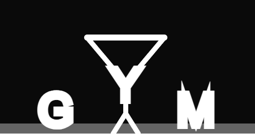

# Animando la tipografía semántica
### Palabra elegida: GYM

### **Concepto visual y semántico:**

La palabra **GYM** se representa visualmente como si fuera una escena en un gimnasio. La letra **“Y”** toma la forma de un personaje humano: su tronco y piernas están fijos al piso, mientras que sus brazos están conectados a una barra que sostiene las letras **“G” y “M”**, representando pesas a los lados.

### Aspectos técnicos y de implementación:
La animación muestra cómo este personaje intenta levantar la barra: primero lo logra, luego tiembla del esfuerzo, y finalmente la suelta y las letras **G** y **M** **caen al suelo**. El movimiento comunica esfuerzo, fatiga y caída, haciendo que la palabra literalmente actúe como su significado: _"GYM"_.

-   Realizado en **p5.js**, simulando el comportamiento físico mediante animaciones personalizadas.
   - Se utilizó la librería **Matter.js** para simular la física real.
-   La letra **“Y”** está dibujada con líneas que forman un cuerpo humano estático.

    
-   Los **brazos del personaje** animan una barra que conecta las letras **“G” y “M”**.
    
-   Se programaron tres fases:
    
    -  Subida de la barra.
        
    -    Temblor por esfuerzo.
        
    -  Caída de la barra y letras hacia los lados con rebote.

### Código

```js
let Engine = Matter.Engine,
    World = Matter.World,
    Bodies = Matter.Bodies,
    Constraint = Matter.Constraint;

let engine, world;
let ground;
let letterG, letterM;

let angle = 0;
let phase = 0;
let timer = 0;
let speed = 0;
let dropG = false;
let dropM = false;
let gVel = 0;
let mVel = 0;
let gy = 0;
let my = 0;

function setup() {
  createCanvas(1000, 600);
  angleMode(DEGREES);
  textAlign(CENTER, CENTER);
  textSize(100);

  engine = Engine.create();
  world = engine.world;
  engine.gravity.y = 1;

  // Piso
  ground = Bodies.rectangle(width / 2, height - 10, width, 20, { isStatic: true });
  World.add(world, ground);

  // Letras físicas (G y M)
  letterG = Bodies.rectangle(width / 2 - 140, 200, 40, 40, { restitution: 0.6 });
  letterM = Bodies.rectangle(width / 2 + 140, 200, 40, 40, { restitution: 0.6 });
  World.add(world, [letterG, letterM]);
}

function draw() {
  background(10);
  Engine.update(engine);

  // Piso visual
  fill(100);
  noStroke();
  rectMode(CENTER);
  rect(width / 2, height - 10, width, 20);

  const cx = width / 2;
  const cy = height - 100;

  // Fases animadas: levantar, vibrar, soltar
  if (phase === 0) {
    angle = lerp(angle, -40, 0.05);
    if (abs(angle + 40) < 1) {
      phase = 1;
      timer = frameCount;
    }
  } else if (phase === 1) {
    angle = -40 + sin((frameCount - timer) * 8) * 2;
    if (frameCount - timer > 100) {
      phase = 2;
      speed = 0;
    }
  } else if (phase === 2) {
    speed += 2;
    angle += speed;
    if (angle >= 50) {
      angle = 50;
      dropG = true;
      dropM = true;
      phase = 3;
    }
  }

  if (dropG) {
    gVel += 1;
    gy += gVel;
    if (gy > 80) {
      gy = 80;
      gVel *= -0.4;
    }
  }

  if (dropM) {
    mVel += 1;
    my += mVel;
    if (my > 80) {
      my = 80;
      mVel *= -0.4;
    }
  }

  drawWordGYM(cx, cy, angle, gy, my);
}

function drawWordGYM(x, y, a, gy, my) {
  // Cuerpo de la "Y"
  stroke(255);
  strokeWeight(10);
  line(x, y, x, y + 60);
  line(x, y + 60, x - 25, y + 100);
  line(x, y + 60, x + 25, y + 100);

  fill(255);
  noStroke();
  textSize(90);

  // Posiciones de brazos
  let r = 120;
  let lx = x - r * cos(a);
  let ly = y - r * sin(a);
  let rx = x + r * cos(a);
  let ry = y - r * sin(a);

  // Brazos
  stroke(255);
  strokeWeight(10);
  line(x, y, lx, ly);
  line(x, y, rx, ry);

  // Barra
  strokeWeight(12);
  line(lx, ly, rx, ry);

  // Letras G y M
  if (phase < 3) {
    text("G", lx - 40, ly);
    text("M", rx + 40, ry);
  } else {
    text("G", letterG.position.x, letterG.position.y);
    text("M", letterM.position.x, letterM.position.y);
  }

  // Letra Y
  fill(255);
  text("Y", x, y + 10);
}

```
[Tipografía Semántica ](https://editor.p5js.org/tiago123fk/sketches/Q33O8qnbV)
#### Imagen

